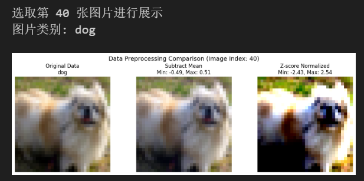
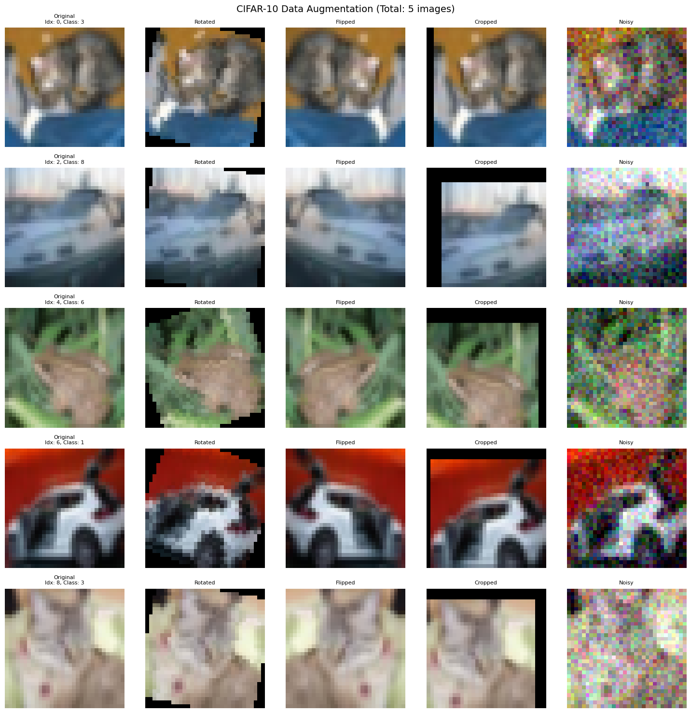

## 第一次实验实验报告
### 实验目的
- 创建机器学习环境（安装IDE、构建python环境、安装机器学习库）
- 下载图像分类数据集，并学习加载导入数据集
- 学习使用Pytorch的DataLoader类加载数据集
- 学习使用Pytorch进行数据预处理和数据增强
### 实验内容
- 1、数据集的使用和数据的读取
创建一个数据集，读取指定batch大小的数据。然后将该批数据规范成统一大小格式，
打印到一张图片里。
- 2、数据的预处理与归一化
在数据集上求取均值，然后所有数据减去该均值，然后再对减去均值之后的数据进行z-
score归一化处理。
选取指定编号的数据，把原数据，减去均值后的数据和归一化之后的数据打印在一张图
片里。
- 3、数据增强
从数据集中选取指定的图片，对该图片分别进行选择旋转、翻转、裁剪、加噪声等操作，
然后将原图和处理后的图像打印到一个图片里。

### 实验过程与结果
- 1.安装机器学习环境
```
conda create -n ml-class python=3.10
conda activate ml-class
pip install torch torchvision torchaudio --index-url https://download.pytorch.org/whl/cu118
pip install ipython jupyter jupyterlab
pip install matplotlib 
```
>由于已经配置好环境忘记截图，该过程不可逆，故不放截图
- 下载数据集cifar10
由于外网下载cifar10数据集较慢，改为在网址[cifar10](https://gitcode.com/open-source-toolkit/94ecd/?utm_source=tools_gitcode&index=top&type=card&&uuid_tt_dd=10_7555513070-1772353432694750401&isLogin=9&from_id=142888733&from_link=94bec6c10ce9359141dc1dca925a2071)手动下载
    - 导入包并读取数据集
```python
import torch
import torchvision
import torchvision.transforms as transforms
import torchvision.datasets as datasets
from torch.utils.data import DataLoader, Dataset
import numpy as np
import matplotlib.pyplot as plt
from PIL import Image
import random
import os

# 设置随机种子
torch.manual_seed(42)
np.random.seed(42)
random.seed(42)

# 检查CUDA
device = torch.device("cuda" if torch.cuda.is_available() else "cpu")
print(f"使用设备: {device}")
print(f"当前工作目录: {os.getcwd()}")
data_path =  './data/cifar-10-python'
target_size = 32
batch_size=64
transform = transforms.Compose([
transforms.ToTensor(), # 将PIL.Image或ndarray转换为Tensor
transforms.Resize(target_size + 4),       # 先放大尺寸
transforms.CenterCrop(target_size), ])     # 再中心裁剪  
# 下载训练集数据，并对数据进如上处理
trainset = torchvision.datasets.CIFAR10(root=data_path, train=True, download=False, transform=transform)
# 把训练集数据载入内存
trainloader = torch.utils.data.DataLoader(trainset, batch_size=batch_size, shuffle=True, num_workers=2)
# 下载测试集数据，并对|数据进行如上处理
testset = torchvision.datasets.CIFAR10(root=data_path, train=False, download=False, transform=transform)
# 把训练集数据载入内存
testloader = torch.utils.data.DataLoader(testset, batch_size=batch_size, shuffle=False, num_workers=2)
```
- 读取并可视化数据集
```python
# 获取一个批次数据
dataiter = iter(trainloader)
images, labels = next(dataiter)

# 选择前10张图片并生成网格
selected_images = images[:10]
grid = torchvision.utils.make_grid(selected_images, nrow=10, padding=2)

# 转换为Matplotlib可显示格式
grid_np = grid.numpy().transpose((1, 2, 0))
# 绘制图像
plt.figure(figsize=(15, 2.5))
plt.imshow(grid_np)
plt.axis('off')
plt.title('CIFAR10 Sample Images')
plt.show()

```

- 2.数据预处理与归一化
    - 计算均值方差
    ```python
    transform_original = transforms.Compose([
    transforms.ToTensor(),])
    #加载原始数据集（不进行归一化）
    print("加载原始数据集...")
    trainset_original = torchvision.datasets.CIFAR10(root=data_path, train=True,                                              download=False,             transform=transform_original)
    trainloader_original = torch.utils.data.DataLoader(trainset_original, batch_size=batch_size, 
                                                shuffle=False, num_workers=2)
    def calculate_mean_std(dataloader):
        """计算数据集的均值和标准差"""
        mean = 0.
        std = 0.
        total_images = 0
        
        for images, _ in dataloader:
            # images shape: [batch_size, channels, height, width]
            batch_samples = images.size(0)
            # 将图片展平为 [batch_size, channels, height*width]
            images = images.view(batch_samples, images.size(1), -1)
            # 计算batch的均值和标准差
            mean += images.mean(2).sum(0)
            std += images.std(2).sum(0)
            total_images += batch_samples
        
        mean /= total_images
        std /= total_images
        
        return mean, std

    # 计算训练集的均值和标准差
    mean, std = calculate_mean_std(trainloader_original)
    ```
    - 减去均值，然后进行z-score归一化
    ```python
    # 减去均值（不进行缩放）
    transform_subtract_mean = transforms.Compose([
        transforms.ToTensor(),
        transforms.Normalize(mean=mean.tolist(), std=[1.0, 1.0, 1.0])  # 只减去均值，不除以标准差
    ])

    # Z-score归一化（减去均值后除以标准差）
    transform_zscore = transforms.Compose([
        transforms.ToTensor(),
        transforms.Normalize(mean=mean.tolist(), std=std.tolist())
    ])

    # 重新加载数据集（使用不同的变换）
    trainset_subtract_mean = torchvision.datasets.CIFAR10(root=data_path, train=True, 
                                                        download=False, transform=transform_subtract_mean)
    trainset_zscore = torchvision.datasets.CIFAR10(root=data_path, train=True, 
                                                download=False, transform=transform_zscore)

    # 创建数据加载器
    trainloader_subtract_mean = torch.utils.data.DataLoader(trainset_subtract_mean, batch_size=batch_size, 
                                                            shuffle=True, num_workers=2)
    trainloader_zscore = torch.utils.data.DataLoader(trainset_zscore, batch_size=batch_size, 
                                                    shuffle=True, num_workers=2)
    ```
    - 选取指定编号的数据，把原数据，减去均值后的数据和归一化之后的数据打印在一张图片里。
    ```python
    selected_index = 40  # 选择第42张图片

    print(f"\n选取第 {selected_index} 张图片进行展示")

    # 获取指定索引的图片
    original_img, label = trainset_original[selected_index]
    subtract_mean_img, _ = trainset_subtract_mean[selected_index]
    zscore_img, _ = trainset_zscore[selected_index]

    # CIFAR-10 类别名称
    classes = ('plane', 'car', 'bird', 'cat', 'deer', 
            'dog', 'frog', 'horse', 'ship', 'truck')

    print(f"图片类别: {classes[label]}")

    # 4. 将三种处理后的数据显示在一张图片里
    fig, axes = plt.subplots(1, 3, figsize=(12, 4))

    # 显示原始数据
    img_original = original_img.numpy().transpose((1, 2, 0))
    axes[0].imshow(img_original)
    axes[0].set_title(f'Original Data\n{classes[label]}')
    axes[0].axis('off')

    # 显示减去均值后的数据
    img_subtract_mean = subtract_mean_img.numpy().transpose((1, 2, 0))
    # 减去均值后的数据范围可能在[-0.5, 0.5]左右，需要调整显示范围
    img_subtract_mean_display = np.clip(img_subtract_mean + 0.5, 0, 1)  # 调整到[0,1]范围显示
    axes[1].imshow(img_subtract_mean_display)
    axes[1].set_title(f'Subtract Mean\nMin: {img_subtract_mean.min():.2f}, Max: {img_subtract_mean.max():.2f}')
    axes[1].axis('off')

    # 显示Z-score归一化后的数据
    img_zscore = zscore_img.numpy().transpose((1, 2, 0))
    # Z-score归一化后的数据范围更广，需要调整显示范围
    img_zscore_display = np.clip(img_zscore * 0.5 + 0.5, 0, 1)  # 调整到[0,1]范围显示
    axes[2].imshow(img_zscore_display)
    axes[2].set_title(f'Z-score Normalized\nMin: {img_zscore.min():.2f}, Max: {img_zscore.max():.2f}')
    axes[2].axis('off')

    plt.suptitle(f'Data Preprocessing Comparison (Image Index: {selected_index})', fontsize=14)
    plt.tight_layout()
    plt.show()
    ```
    
- 3.数据增强
    - 定义旋转、翻转、裁剪、加噪声等操作
    ```python
        # 定义不同的图像变换
    transform_rotate = transforms.Compose([
        transforms.RandomRotation(30),
    ])

    transform_flip = transforms.Compose([
        transforms.RandomHorizontalFlip(p=1),
    ])

    transform_crop = transforms.Compose([
        transforms.RandomCrop(32, padding=4),
    ])

    def add_noise(tensor, noise_level=0.1):
        """添加高斯噪声"""
        noise = torch.randn(tensor.size()) * noise_level
    return torch.clamp(tensor + noise, 0, 1)
    ```
    - 定义处理函数
    ```python
    def process_images_with_augmentation(dataset, indices, save_path='cifar10_augmentations.png'):
    """
    灵活的图像增强处理函数
    
    参数:
        testset: CIFAR10数据集
        indices: 可以是整数、列表、切片等
        save_path: 保存图片的路径
    """
    # 处理索引，使其统一为列表
    if isinstance(indices, int):
        indices = [indices]
    elif isinstance(indices, slice):
        # 处理切片，如 [0:10] 或 [::2]
        start = indices.start if indices.start is not None else 0
        stop = indices.stop if indices.stop is not None else len(dataset)
        step = indices.step if indices.step is not None else 1
        indices = list(range(start, stop, step))
    elif isinstance(indices, list):
        indices = indices
    elif isinstance(indices, tuple):
        indices = list(indices)
    else:
        raise ValueError(f"不支持的索引类型: {type(indices)}")
    
    # 确保索引不超过数据集大小
    indices = [i for i in indices if i < len(dataset)]
    
    if not indices:
        print("没有有效的索引！")
        return
    
    n_images = len(indices)
    print(f"处理 {n_images} 张图片，索引: {indices}")
    
    # 创建大图画布
    fig, axs = plt.subplots(n_images, 5, figsize=(15, 3 * n_images))
    plt.subplots_adjust(wspace=0.1, hspace=0.3)
    
    # 如果只有一张图片，axs需要转换为2D数组
    if n_images == 1:
        axs = axs.reshape(1, -1)
    
    # 处理并绘制每个图像
    for row, idx in enumerate(indices):
        # 获取原始图像
        original_img, label = testset[idx]
        
        # 原始图像
        original_np = original_img.numpy().transpose((1, 2, 0))
        axs[row, 0].imshow(original_np)
        axs[row, 0].set_title(f"Original\nIdx: {idx}, Class: {label}", fontsize=8)
        
        # 旋转后的图像
        rotated_img = transform_rotate(original_img)
        rotated_np = rotated_img.numpy().transpose((1, 2, 0))
        axs[row, 1].imshow(rotated_np)
        axs[row, 1].set_title("Rotated", fontsize=8)
        
        # 翻转后的图像
        flipped_img = transform_flip(original_img)
        flipped_np = flipped_img.numpy().transpose((1, 2, 0))
        axs[row, 2].imshow(flipped_np)
        axs[row, 2].set_title("Flipped", fontsize=8)
        
        # 裁剪后的图像
        cropped_img = transform_crop(original_img)
        cropped_np = cropped_img.numpy().transpose((1, 2, 0))
        axs[row, 3].imshow(cropped_np)
        axs[row, 3].set_title("Cropped", fontsize=8)
        
        # 加噪声后的图像
        noisy_img = add_noise(original_img, noise_level=0.1)
        noisy_np = noisy_img.numpy().transpose((1, 2, 0))
        axs[row, 4].imshow(noisy_np)
        axs[row, 4].set_title("Noisy", fontsize=8)
        
        # 关闭当前行的坐标轴
        for col in range(5):
            axs[row, col].axis('off')
    
    plt.suptitle(f'CIFAR-10 Data Augmentation (Total: {n_images} images)', fontsize=14)
    plt.tight_layout()
    plt.show()
    ```
    - 示例测试
    ```python
    process_images_with_augmentation(trainset_original, slice(0,10,2), 'cifar10_augmentations_1.png')
    ```
    
### 总结
- 本次实验成功搭建了基于Python 3.10和CUDA 11.8的PyTorch深度学习环境，并系统学习了CIFAR-10图像数据集的处理流程。在数据加载方面，掌握了使用DataLoader批量读取数据并可视化展示的方法；在预处理方面，通过计算数据集均值和标准差，实现了减去均值和Z-score归一化两种处理方式，并对比展示了原始数据、去均值数据和归一化数据的效果差异；在数据增强方面，对指定图像应用了旋转、翻转、裁剪、加噪声等操作，有效扩充了数据多样性。

- 通过本次实验，深入理解了数据预处理和数据增强在深度学习中的重要性。数据归一化能够加速模型收敛并提升训练稳定性，而数据增强则能有效防止过拟合，增强模型的泛化能力。实验过程中遇到的数据集下载慢、图像显示范围调整等问题，通过手动下载数据和合理设置显示参数得到了解决。这些实践为后续构建和训练图像分类模型奠定了坚实的基础。

### 附录
提交在ml-exp1.ipynb文件中,所有代码在上述均已展示，这里不再赘述。


