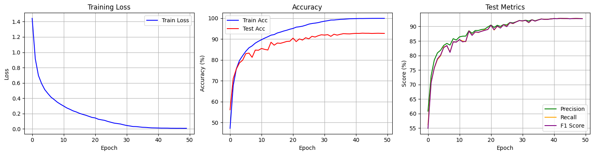
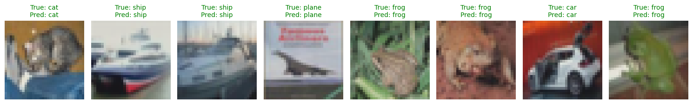
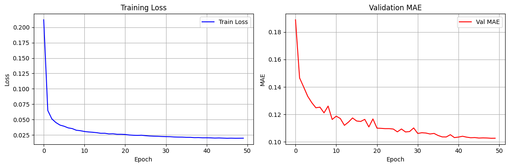
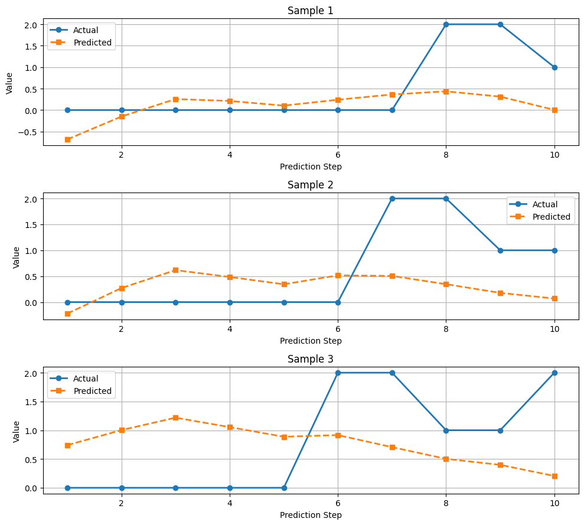
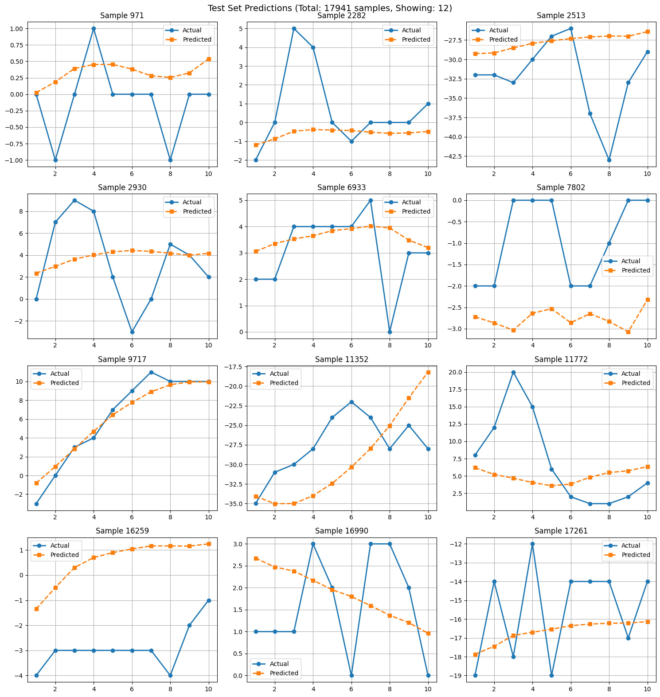

## 第2次实验实验报告
### 实验目的
1.针对图像分类任务，学习并实现卷积神经网络。
2.针对时序预测任务，学习并实现循环神经网络。
3.通过调整学学习率，优化方法和Batch大小，了解超参数对深度学习模型性能的影响。
### 实验内容
**一、图像分类**
对Cifar10数据集，用两种深度学习模型VGG和ResNet进行分类，对比分类结果。
在示例代码基础上增加层数，调整每个模型的训练参数，包括优化方法、学习率、batch大
小等等，观察这些参数对模型训练和测试结果的影响。
**二、时序数据预测**
对UCR的ECG数据集或者其它时序数据集，用两种深度学习模型进行多步预测，对比预测结果
在示例代码基础上进行修改，并调整每个模型的训练参数，包括优化方法、学习率、时间步
大小等等，观察这些参数对模型训练和测试结果的影响
### 实验步骤与结果
#### 图像分类
- **定义数据集类与数据加载器**
>对数据预处理归一化以及封装成batch
```python
class CIFAR10DataLoader:
    """CIFAR-10数据加载器类，统一管理数据加载、预处理和统计量计算"""

    def __init__(self, data_path, batch_size=64, num_workers=2, download=False):
        self.data_path = data_path
        self.batch_size = batch_size
        self.num_workers = num_workers

        # 计算数据集的均值和标准差（基于原始训练数据）
        self.mean, self.std = self._calculate_dataset_stats(download)

        # 创建数据加载器
        self.train_loader = None
        self.test_loader = None
        self._create_loaders()

        # 类别名称
        self.classes = ('plane', 'car', 'bird', 'cat', 'deer',
                       'dog', 'frog', 'horse', 'ship', 'truck')

    def _calculate_dataset_stats(self, download):
        """计算原始数据集的均值和标准差"""
        print("正在计算数据集的均值和标准差...")

        # 直接用transforms.ToTensor()加载原始数据
        temp_transform = transforms.Compose([transforms.ToTensor()])
        temp_dataset = torchvision.datasets.CIFAR10(
            root=self.data_path, train=True, download=download, transform=temp_transform
        )
        temp_loader = DataLoader(temp_dataset, batch_size=64, shuffle=False)

        channels_sum = 0
        channels_squared_sum = 0
        num_batches = 0

        for images, _ in temp_loader:
            channels_sum += torch.mean(images, dim=[0, 2, 3])
            channels_squared_sum += torch.mean(images ** 2, dim=[0, 2, 3])
            num_batches += 1

        mean = channels_sum / num_batches
        std = (channels_squared_sum / num_batches - mean ** 2) ** 0.5

        print(f"计算得到的均值: {mean}")
        print(f"计算得到的标准差: {std}")

        return mean, std

    def _create_loaders(self):
        """创建训练和测试数据加载器"""
        # 训练数据增强
        transform_train = transforms.Compose([
            transforms.RandomCrop(32, padding=4),
            transforms.RandomHorizontalFlip(),
            transforms.ToTensor(),
            transforms.Normalize(self.mean, self.std)
        ])

        # 测试数据预处理（无增强）
        transform_test = transforms.Compose([
            transforms.ToTensor(),
            transforms.Normalize(self.mean, self.std)
        ])

        # 直接创建数据集，不需要额外的Dataset类
        train_dataset = torchvision.datasets.CIFAR10(
            root=self.data_path, train=True, transform=transform_train, download=True
        )
        test_dataset = torchvision.datasets.CIFAR10(
            root=self.data_path, train=False, transform=transform_test, download=True
        )

        # 创建数据加载器
        self.train_loader = DataLoader(
            train_dataset, batch_size=self.batch_size, shuffle=True,
            num_workers=self.num_workers, pin_memory=True if torch.cuda.is_available() else False
        )
        self.test_loader = DataLoader(
            test_dataset, batch_size=self.batch_size, shuffle=False,
            num_workers=self.num_workers, pin_memory=True if torch.cuda.is_available() else False
        )

    def get_train_loader(self):
        return self.train_loader

    def get_test_loader(self):
        return self.test_loader

    def set_batch_size(self, batch_size):
        """动态修改batch size"""
        if self.batch_size != batch_size:
            self.batch_size = batch_size
            self._create_loaders()
            print(f"Batch size 已更新为: {batch_size}")

    def get_stats(self):
        """返回数据的均值和标准差"""
        return self.mean, self.std
# 类别名称
classes = ('plane', 'car', 'bird', 'cat', 'deer',
           'dog', 'frog', 'horse', 'ship', 'truck')
```
- **VGG实现**
```python
class VGG(nn.Module):
    def __init__(self, num_classes=10):
        super(VGG, self).__init__()

        # VGG11 配置
        self.features = nn.Sequential(
            # Block 1
            nn.Conv2d(3, 64, kernel_size=3, padding=1),
            nn.BatchNorm2d(64),
            nn.ReLU(inplace=True),
            nn.MaxPool2d(kernel_size=2, stride=2),

            # Block 2
            nn.Conv2d(64, 128, kernel_size=3, padding=1),
            nn.BatchNorm2d(128),
            nn.ReLU(inplace=True),
            nn.MaxPool2d(kernel_size=2, stride=2),

            # Block 3
            nn.Conv2d(128, 256, kernel_size=3, padding=1),
            nn.BatchNorm2d(256),
            nn.ReLU(inplace=True),
            nn.Conv2d(256, 256, kernel_size=3, padding=1),
            nn.BatchNorm2d(256),
            nn.ReLU(inplace=True),
            nn.MaxPool2d(kernel_size=2, stride=2),

            # Block 4
            nn.Conv2d(256, 512, kernel_size=3, padding=1),
            nn.BatchNorm2d(512),
            nn.ReLU(inplace=True),
            nn.Conv2d(512, 512, kernel_size=3, padding=1),
            nn.BatchNorm2d(512),
            nn.ReLU(inplace=True),
            nn.MaxPool2d(kernel_size=2, stride=2),

            # Block 5
            nn.Conv2d(512, 512, kernel_size=3, padding=1),
            nn.BatchNorm2d(512),
            nn.ReLU(inplace=True),
            nn.Conv2d(512, 512, kernel_size=3, padding=1),
            nn.BatchNorm2d(512),
            nn.ReLU(inplace=True),
            nn.MaxPool2d(kernel_size=2, stride=2),
        )

        self.classifier = nn.Sequential(
            nn.Linear(512 * 1 * 1, 4096),
            nn.ReLU(inplace=True),
            nn.Dropout(0.5),
            nn.Linear(4096, 4096),
            nn.ReLU(inplace=True),
            nn.Dropout(0.5),
            nn.Linear(4096, num_classes),
        )

    def forward(self, x):
        x = self.features(x)
        x = x.view(x.size(0), -1)
        x = self.classifier(x)
        return x

# 创建 VGG 模型
vgg_model = VGG(num_classes=10).to(device)
print(vgg_model)
```
- **ResNet18实现**
```python
class BasicBlock(nn.Module):
    expansion = 1

    def __init__(self, in_channels, out_channels, stride=1):
        super(BasicBlock, self).__init__()

        self.conv1 = nn.Conv2d(in_channels, out_channels, kernel_size=3, stride=stride, padding=1, bias=False)
        self.bn1 = nn.BatchNorm2d(out_channels)
        self.conv2 = nn.Conv2d(out_channels, out_channels, kernel_size=3, stride=1, padding=1, bias=False)
        self.bn2 = nn.BatchNorm2d(out_channels)

        self.shortcut = nn.Sequential()
        if stride != 1 or in_channels != out_channels:
            self.shortcut = nn.Sequential(
                nn.Conv2d(in_channels, out_channels, kernel_size=1, stride=stride, bias=False),
                nn.BatchNorm2d(out_channels)
            )

    def forward(self, x):
        out = torch.relu(self.bn1(self.conv1(x)))
        out = self.bn2(self.conv2(out))
        out += self.shortcut(x)
        out = torch.relu(out)
        return out

class ResNet(nn.Module):
    def __init__(self, block, num_blocks, num_classes=10):
        super(ResNet, self).__init__()
        self.in_channels = 64

        self.conv1 = nn.Conv2d(3, 64, kernel_size=3, stride=1, padding=1, bias=False)
        self.bn1 = nn.BatchNorm2d(64)

        self.layer1 = self._make_layer(block, 64, num_blocks[0], stride=1)
        self.layer2 = self._make_layer(block, 128, num_blocks[1], stride=2)
        self.layer3 = self._make_layer(block, 256, num_blocks[2], stride=2)
        self.layer4 = self._make_layer(block, 512, num_blocks[3], stride=2)

        self.linear = nn.Linear(512 * block.expansion, num_classes)

    def _make_layer(self, block, out_channels, num_blocks, stride):
        strides = [stride] + [1] * (num_blocks - 1)
        layers = []
        for stride in strides:
            layers.append(block(self.in_channels, out_channels, stride))
            self.in_channels = out_channels * block.expansion
        return nn.Sequential(*layers)

    def forward(self, x):
        out = torch.relu(self.bn1(self.conv1(x)))
        out = self.layer1(out)
        out = self.layer2(out)
        out = self.layer3(out)
        out = self.layer4(out)
        out = nn.functional.avg_pool2d(out, 4)
        out = out.view(out.size(0), -1)
        out = self.linear(out)
        return out

def ResNet18():
    return ResNet(BasicBlock, [2, 2, 2, 2])

# 创建 ResNet 模型
resnet_model = ResNet18().to(device)
print(resnet_model)
```
- **定义训练器Trainer**
>封装好训练评估函数以及可视化测试函数
```python
class ModelTrainer:
    """模型训练器类，封装训练、评估和可视化功能"""

    def __init__(self, model, device=None):
        """
        初始化训练器
        Args:
            model: 要训练的模型
            device: 计算设备，如果为None则自动选择
        """
        self.model = model
        self.device = device if device else torch.device('cuda' if torch.cuda.is_available() else 'cpu')
        print(f"Using device: {device}")
        self.model = self.model.to(self.device)

        # 训练历史记录
        self.train_losses = []
        self.train_accs = []
        self.test_accs = []
        self.test_precisions = []
        self.test_recalls = []
        self.test_f1s = []

        # 最佳模型记录
        self.best_test_acc = 0
        self.best_epoch = -1

    def train(self, train_loader, test_loader, epochs=50,
              optimizer_name='adam', lr=0.001, weight_decay=0,
              scheduler_type='cosine', class_names=None, verbose=True):
        """
        训练模型
        Args:
            train_loader: 训练数据加载器
            test_loader: 测试数据加载器
            epochs: 训练轮数
            optimizer_name: 优化器名称 ('adam', 'sgd', 'rmsprop')
            lr: 学习率
            weight_decay: 权重衰减
            scheduler_type: 学习率调度器类型 ('cosine', 'step', 'none')
            class_names: 类别名称列表，用于评估时打印
            verbose: 是否打印详细信息
        Returns:
            self: 返回自身，支持链式调用
        """
        criterion = nn.CrossEntropyLoss()

        # 选择优化器
        optimizer = self._get_optimizer(optimizer_name, lr, weight_decay)

        # 选择学习率调度器
        scheduler = self._get_scheduler(optimizer, scheduler_type, epochs)

        for epoch in range(epochs):
            # 训练一个epoch
            train_loss, train_acc = self._train_epoch(
                train_loader, criterion, optimizer, epoch, epochs, verbose
            )

            # 在测试集上评估
            test_metrics = self.evaluate(test_loader, class_names=class_names, verbose=False)

            # 记录历史
            self.train_losses.append(train_loss)
            self.train_accs.append(train_acc)
            self.test_accs.append(test_metrics['accuracy'])
            self.test_precisions.append(test_metrics['precision'])
            self.test_recalls.append(test_metrics['recall'])
            self.test_f1s.append(test_metrics['f1'])

            # 保存最佳模型
            if test_metrics['accuracy'] > self.best_test_acc:
                self.best_test_acc = test_metrics['accuracy']
                self.best_epoch = epoch + 1
                self._save_best_model()

            # 更新学习率
            if scheduler:
                scheduler.step()

            # 打印进度
            if verbose:
                current_lr = optimizer.param_groups[0]['lr']
                print(f'Epoch {epoch+1}/{epochs}: '
                      f'Train Loss: {train_loss:.4f}, Train Acc: {train_acc:.2f}%, '
                      f'Test Acc: {test_metrics["accuracy"]:.2f}%, LR: {current_lr:.6f}')

        # 训练结束，恢复最佳模型
        self._restore_best_model()

        if verbose:
            print(f"\n训练完成！最佳测试准确率: {self.best_test_acc:.2f}% (Epoch {self.best_epoch})")

        return self

    def _train_epoch(self, train_loader, criterion, optimizer, epoch, total_epochs, verbose):
        """训练一个epoch"""
        self.model.train()
        running_loss = 0.0
        correct = 0
        total = 0

        iterator = tqdm(train_loader, desc=f'Epoch {epoch+1}/{total_epochs}') if verbose else train_loader

        for inputs, targets in iterator:
            inputs, targets = inputs.to(self.device), targets.to(self.device)

            optimizer.zero_grad()
            outputs = self.model(inputs)
            loss = criterion(outputs, targets)
            loss.backward()
            optimizer.step()

            running_loss += loss.item()
            _, predicted = outputs.max(1)
            total += targets.size(0)
            correct += predicted.eq(targets).sum().item()

        train_loss = running_loss / len(train_loader)
        train_acc = 100. * correct / total

        return train_loss, train_acc

    def evaluate(self, test_loader, class_names=None, verbose=True, num_examples=5):
        """
        评估模型
        Args:
            test_loader: 测试数据加载器
            class_names: 类别名称列表
            verbose: 是否打印详细信息
            num_examples: 打印的测试案例数量
        Returns:
            dict: 包含各种评估指标的字典
        """
        self.model.eval()

        all_preds = []
        all_targets = []
        all_images = []

        with torch.no_grad():
            for inputs, targets in test_loader:
                inputs, targets = inputs.to(self.device), targets.to(self.device)
                outputs = self.model(inputs)
                _, predicted = outputs.max(1)

                all_preds.extend(predicted.cpu().numpy())
                all_targets.extend(targets.cpu().numpy())

                # 保存前num_examples张图片用于展示
                if len(all_images) < num_examples:
                    remaining = num_examples - len(all_images)
                    all_images.extend(inputs[:remaining].cpu())

        # 转换为numpy数组
        all_preds = np.array(all_preds)
        all_targets = np.array(all_targets)

        # 计算各项指标
        from sklearn.metrics import accuracy_score, precision_score, recall_score, f1_score, confusion_matrix

        accuracy = accuracy_score(all_targets, all_preds) * 100
        precision = precision_score(all_targets, all_preds, average='macro', zero_division=0) * 100
        recall = recall_score(all_targets, all_preds, average='macro', zero_division=0) * 100
        f1 = f1_score(all_targets, all_preds, average='macro', zero_division=0) * 100

        # 每类的精确率和召回率
        per_class_precision = precision_score(all_targets, all_preds, average=None, zero_division=0) * 100
        per_class_recall = recall_score(all_targets, all_preds, average=None, zero_division=0) * 100

        metrics = {
            'accuracy': accuracy,
            'precision': precision,
            'recall': recall,
            'f1': f1,
            'per_class_precision': per_class_precision,
            'per_class_recall': per_class_recall,
            'confusion_matrix': confusion_matrix(all_targets, all_preds),
            'predictions': all_preds,
            'targets': all_targets,
            'images': all_images
        }

        if verbose:
            self._print_metrics(metrics, class_names, num_examples)

        return metrics

    def _print_metrics(self, metrics, class_names=None, num_examples=5):
        """打印评估指标和可视化结果"""
        print("\n" + "="*60)
        print("模型评估结果")
        print("="*60)
        print(f"准确率 (Accuracy): {metrics['accuracy']:.2f}%")
        print(f"宏平均精确率 (Macro Precision): {metrics['precision']:.2f}%")
        print(f"宏平均召回率 (Macro Recall): {metrics['recall']:.2f}%")
        print(f"宏平均F1分数 (Macro F1): {metrics['f1']:.2f}%")

        if class_names:
            print("\n各类别详细指标:")
            print("-"*60)
            print(f"{'类别':<12} {'精确率':<10} {'召回率':<10}")
            print("-"*60)
            for i, name in enumerate(class_names):
                print(f"{name:<12} {metrics['per_class_precision'][i]:<10.2f}% {metrics['per_class_recall'][i]:<10.2f}%")

        # 混淆矩阵
        cm = metrics['confusion_matrix']
        print("\n混淆矩阵:")
        print("-"*60)
        if class_names and len(class_names) <= 10:
            print("     " + " ".join([f"{name[:3]:>4}" for name in class_names]))
            for i in range(len(class_names)):
                print(f"{class_names[i][:3]:>4} " + " ".join([f"{cm[i,j]:>4}" for j in range(len(class_names))]))
        else:
            print(cm)

        # 可视化测试案例
        if class_names and metrics['images']:
            self._visualize_predictions(metrics, class_names, num_examples)

    def _visualize_predictions(self, metrics, class_names, num_examples):
        """可视化预测结果"""
        print("\n" + "="*60)
        print(f"测试案例展示 (共{num_examples}张)")
        print("="*60)

        fig, axes = plt.subplots(1, num_examples, figsize=(15, 3))
        if num_examples == 1:
            axes = [axes]

        # 注意：这里需要知道mean和std，可以通过参数传入
        # 或者从数据加载器获取，这里使用CIFAR-10的默认值
        mean = np.array([0.4914, 0.4822, 0.4465])
        std = np.array([0.2023, 0.1994, 0.2010])

        for i in range(num_examples):
            img = metrics['images'][i]
            img = img.numpy().transpose(1, 2, 0)
            img = img * std + mean  # 反归一化
            img = np.clip(img, 0, 1)

            axes[i].imshow(img)
            true_label = class_names[metrics['targets'][i]]
            pred_label = class_names[metrics['predictions'][i]]
            color = 'green' if metrics['targets'][i] == metrics['predictions'][i] else 'red'
            axes[i].set_title(f'True: {true_label}\nPred: {pred_label}', fontsize=10, color=color)
            axes[i].axis('off')

        plt.tight_layout()
        plt.show()

    def plot_history(self):
        """绘制训练历史曲线"""
        fig, axes = plt.subplots(1, 3, figsize=(15, 4))

        # 损失曲线
        axes[0].plot(self.train_losses, label='Train Loss', color='blue')
        axes[0].set_xlabel('Epoch')
        axes[0].set_ylabel('Loss')
        axes[0].set_title('Training Loss')
        axes[0].legend()
        axes[0].grid(True)

        # 准确率曲线
        axes[1].plot(self.train_accs, label='Train Acc', color='blue')
        axes[1].plot(self.test_accs, label='Test Acc', color='red')
        axes[1].set_xlabel('Epoch')
        axes[1].set_ylabel('Accuracy (%)')
        axes[1].set_title('Accuracy')
        axes[1].legend()
        axes[1].grid(True)

        # 其他指标曲线
        axes[2].plot(self.test_precisions, label='Precision', color='green')
        axes[2].plot(self.test_recalls, label='Recall', color='orange')
        axes[2].plot(self.test_f1s, label='F1 Score', color='purple')
        axes[2].set_xlabel('Epoch')
        axes[2].set_ylabel('Score (%)')
        axes[2].set_title('Test Metrics')
        axes[2].legend()
        axes[2].grid(True)

        plt.tight_layout()
        plt.show()

    def _get_optimizer(self, optimizer_name, lr, weight_decay):
        """获取优化器"""
        if optimizer_name.lower() == 'adam':
            return optim.Adam(self.model.parameters(), lr=lr, weight_decay=weight_decay)
        elif optimizer_name.lower() == 'sgd':
            return optim.SGD(self.model.parameters(), lr=lr, momentum=0.9, weight_decay=weight_decay)
        elif optimizer_name.lower() == 'rmsprop':
            return optim.RMSprop(self.model.parameters(), lr=lr, weight_decay=weight_decay)
        else:
            raise ValueError(f"不支持的优化器: {optimizer_name}")

    def _get_scheduler(self, optimizer, scheduler_type, epochs):
        """获取学习率调度器"""
        if scheduler_type.lower() == 'cosine':
            return optim.lr_scheduler.CosineAnnealingLR(optimizer, T_max=epochs)
        elif scheduler_type.lower() == 'step':
            return optim.lr_scheduler.StepLR(optimizer, step_size=epochs//3, gamma=0.1)
        else:
            return None

    def _save_best_model(self):
        """保存最佳模型"""
        self.best_model_state = {k: v.cpu().clone() for k, v in self.model.state_dict().items()}

    def _restore_best_model(self):
        """恢复最佳模型"""
        if hasattr(self, 'best_model_state'):
            self.model.load_state_dict(self.best_model_state)
            self.model.to(self.device)

    def save_model(self, path):
        """保存模型到文件"""
        torch.save({
            'model_state_dict': self.model.state_dict(),
            'train_losses': self.train_losses,
            'train_accs': self.train_accs,
            'test_accs': self.test_accs,
            'test_precisions': self.test_precisions,
            'test_recalls': self.test_recalls,
            'test_f1s': self.test_f1s,
            'best_test_acc': self.best_test_acc,
            'best_epoch': self.best_epoch
        }, path)
        print(f"模型已保存到: {path}")

    def load_model(self, path):
        """从文件加载模型"""
        checkpoint = torch.load(path)
        self.model.load_state_dict(checkpoint['model_state_dict'])
        self.train_losses = checkpoint.get('train_losses', [])
        self.train_accs = checkpoint.get('train_accs', [])
        self.test_accs = checkpoint.get('test_accs', [])
        self.test_precisions = checkpoint.get('test_precisions', [])
        self.test_recalls = checkpoint.get('test_recalls', [])
        self.test_f1s = checkpoint.get('test_f1s', [])
        self.best_test_acc = checkpoint.get('best_test_acc', 0)
        self.best_epoch = checkpoint.get('best_epoch', -1)
        print(f"模型已从: {path} 加载")

    def get_model(self):
        """返回模型"""
        return self.model
```
- **示例结果展示**
```python
data_loader = CIFAR10DataLoader(
        data_path='./xjtu-ml-class/exp/data/cifar-10-python',
        batch_size=128,
        num_workers=2
    )

# 2. 创建模型（这里以ResNet18为例）
Res18_model = ResNet18()  # 假设你已经定义了ResNet18

# 3. 创建训练器
trainer_res = ModelTrainer(Res18_model, device=device)

# 4. 训练模型
trainer_res.train(
    train_loader=data_loader.get_train_loader(),
    test_loader=data_loader.get_test_loader(),
    epochs=50,
    optimizer_name='sgd',
    lr=0.01,
    weight_decay=5e-4,
    scheduler_type='cosine',
    class_names=data_loader.classes,
    verbose=True
)

# 5. 绘制训练曲线
trainer_res.plot_history()

# 6. 最终评估
metrics = trainer_res.evaluate(
    test_loader=data_loader.get_test_loader(),
    class_names=data_loader.classes,
    verbose=True,
    num_examples=8
)

# 7. 保存模型
trainer_res.save_model('./Res18_rl1_sgd_batch128.pth')
```


- **输出日志**
```text
============================================================
模型评估结果
============================================================
准确率 (Accuracy): 92.78%
宏平均精确率 (Macro Precision): 92.77%
宏平均召回率 (Macro Recall): 92.78%
宏平均F1分数 (Macro F1): 92.77%

各类别详细指标:
------------------------------------------------------------
类别           精确率        召回率       
------------------------------------------------------------
plane        92.53     % 94.10     %
car          96.52     % 97.10     %
bird         89.20     % 90.00     %
cat          87.11     % 84.50     %
deer         91.44     % 94.00     %
dog          89.63     % 88.20     %
frog         94.69     % 94.50     %
horse        95.11     % 95.40     %
ship         96.45     % 95.00     %
truck        95.00     % 95.00     %

混淆矩阵:
------------------------------------------------------------
      pla  car  bir  cat  dee  dog  fro  hor  shi  tru
 pla  941    3   17    7    6    0    1    1   17    7
 car    5  971    0    0    0    0    0    0    2   22
 bir   18    0  900   14   25   15   19    8    1    0
 cat    6    1   25  845   24   61   19   11    4    4
 dee    2    1   19    8  940   11    8   10    0    1
 dog    3    1   19   61   15  882    0   16    2    1
 fro    4    0   18   21    4    4  945    2    1    1
 hor    7    0    4    4   14   11    3  954    0    3
 shi   23    4    4    4    0    0    3    1  950   11
 tru    8   25    3    6    0    0    0    0    8  950

============================================================
测试案例展示 (共8张)
============================================================
```
>由于训练了多个模型 一一展示过于冗杂，参加压缩包exp2的ml-exp2-img.ipynb文件中包含了训练结果的所有日志与可视化结果。
##### 对比试验
|model|batch|epoch|optimizer|lr|acc|recall|precision|f1-score|
|----|----|-----|-----|---------|---------|---|-------|--------|
|resnet18|128|50|sgd|0.01|92.78|92.78|92.77|92.77|
|vgg|128|50|sgd|0.01|90.30|90.30|90.36|90.32|
|resnet18|128|20|adam|0.001|80.72|80.63|80.74|80.68|
|vgg|128|50|sgd|0.005|91.59|91.59|91.59|91.59|
|resnet18|256|50|sgd|0.001|93.29|93.28|93.29|93.28|

##### 实验结果分析
**1. 模型对比**
- ResNet18 整体优于 VGG，同条件下领先约 2.5%
- ResNet18 最佳 93.29% vs VGG 最佳 91.59%

**2. 优化器影响**
- SGD 效果显著优于 Adam
- ResNet18 上 SGD (93.29%) 比 Adam (80.72%) 高 12.6%

**3. 学习率影响**
- 较小学习率效果更好：lr=0.001 > 0.01（ResNet18）
- VGG 上 lr=0.005 > 0.01

**4. 批次大小**
- batch=256 略优于 batch=128（93.29% vs 92.78%）

**理论分析**：从理论角度分析，学习率直接影响参数更新的步长，较小学习率（0.001-0.005）使损失函数收敛更平稳，避免在最优解附近震荡，因此效果优于较大学习率（0.01）。Batch size 影响梯度估计的准确性，较大 batch（256）可降低梯度方差，使训练更稳定，实验显示略优于 128。优化器方面，SGD 依靠真实梯度方向更新参数，稳态收敛精度高；Adam 虽收敛速度快，但自适应学习率可能导致泛化能力下降，实验中 SGD 比 Adam 高出 12.6%，证明此分类任务更适合 SGD。模型结构上，ResNet18 引入残差连接，有效缓解梯度消失问题，深层网络优化更充分；VGG 结构较浅且无跳跃连接，特征提取能力有限，因此 ResNet18 在各配置下均优于 VGG（领先约 2.5%）。综上，采用 ResNet18 + SGD + 较小学习率 + 较大 batch 可获得最佳效果。

#### 时序预测
- **定义时序数据集类**
```python
class TimeSeriesDataset(Dataset):
    """时间序列数据集类"""
    def __init__(self, data, input_len, output_len):
        if data.ndim == 1:
            data = data.reshape(-1, 1)

        self.data = torch.FloatTensor(data)
        self.input_len = input_len
        self.output_len = output_len
        self.n_features = data.shape[1]

        # 创建样本
        self.X = []
        self.y = []
        for i in range(len(data) - input_len - output_len + 1):
            self.X.append(data[i:i+input_len])
            self.y.append(data[i+input_len:i+input_len+output_len])

        self.X = torch.FloatTensor(np.array(self.X))
        self.y = torch.FloatTensor(np.array(self.y))

    def __len__(self):
        return len(self.X)

    def __getitem__(self, idx):
        return self.X[idx], self.y[idx]
```
- **定义数据预处理类**
```python
class ECGDataLoader:
    """ECG数据加载器 - 一键加载和预处理（支持单文件或多文件）"""

    def __init__(self, filepaths, input_len=50, output_len=10,
                 train_ratio=0.7, val_ratio=0.15, batch_size=64):
        """
        一键加载ECG数据并创建数据加载器

        Args:
            filepaths: 文件路径，可以是字符串（单文件）或列表（多文件）
            input_len: 输入序列长度
            output_len: 输出序列长度（预测步数）
            train_ratio: 训练集比例
            val_ratio: 验证集比例
            batch_size: 批次大小
        """
        self.input_len = input_len
        self.output_len = output_len
        self.batch_size = batch_size
        self.scaler = StandardScaler()

        # 加载并预处理数据
        self._load_data(filepaths)
        self._prepare_datasets(train_ratio, val_ratio)
        self._create_dataloaders()

    def _load_data(self, filepaths):
        """加载单文件或多文件数据"""
        # 统一转换为列表
        if isinstance(filepaths, str):
            filepaths = [filepaths]

        all_data = []
        for filepath in filepaths:
            data = []
            with open(filepath, 'r') as f:
                for line in f:
                    line = line.strip()
                    if line:
                        try:
                            data.append(float(line))
                        except:
                            continue

            if data:
                data_array = np.array(data)
                all_data.extend(data_array)
                print(f"加载 {Path(filepath).name}: {len(data_array)} 个数据点")
            else:
                print(f"警告: {filepath} 无有效数据")

        if not all_data:
            raise ValueError("没有加载到任何数据")

        self.raw_data = np.array(all_data)
        print(f"\n总数据点: {len(self.raw_data)}")
        print(f"数据范围: [{self.raw_data.min():.2f}, {self.raw_data.max():.2f}]")

    def _prepare_datasets(self, train_ratio, val_ratio):
        """准备数据集"""
        # 标准化
        data_scaled = self.scaler.fit_transform(self.raw_data.reshape(-1, 1)).flatten()

        # 划分
        n = len(data_scaled)
        train_end = int(n * train_ratio)
        val_end = int(n * (train_ratio + val_ratio))

        train_data = data_scaled[:train_end]
        val_data = data_scaled[train_end:val_end]
        test_data = data_scaled[val_end:]

        # 创建数据集
        self.train_dataset = TimeSeriesDataset(train_data, self.input_len, self.output_len)
        self.val_dataset = TimeSeriesDataset(val_data, self.input_len, self.output_len)
        self.test_dataset = TimeSeriesDataset(test_data, self.input_len, self.output_len)

        print(f"\n数据集划分:")
        print(f"  训练样本: {len(self.train_dataset)}")
        print(f"  验证样本: {len(self.val_dataset)}")
        print(f"  测试样本: {len(self.test_dataset)}")

    def _create_dataloaders(self):
        """创建数据加载器"""
        self.train_loader = DataLoader(self.train_dataset, batch_size=self.batch_size, shuffle=True)
        self.val_loader = DataLoader(self.val_dataset, batch_size=self.batch_size, shuffle=False)
        self.test_loader = DataLoader(self.test_dataset, batch_size=self.batch_size, shuffle=False)

    def inverse_transform(self, data):
        """反标准化"""
        return self.scaler.inverse_transform(data.reshape(-1, 1)).flatten()
```
- **实现LSTM**
```python
class LSTMCell(nn.Module):
    """单个LSTM单元"""
    def __init__(self, input_size, hidden_size):
        super(LSTMCell, self).__init__()
        self.input_size = input_size
        self.hidden_size = hidden_size

        # 输入门、遗忘门、输出门、细胞状态更新的权重和偏置
        self.W_ih = nn.Linear(input_size, 4 * hidden_size, bias=True)
        self.W_hh = nn.Linear(hidden_size, 4 * hidden_size, bias=True)

    def forward(self, x, state):
        h, c = state

        # 线性变换
        gates = self.W_ih(x) + self.W_hh(h)

        # 分割成4个门
        i_gate, f_gate, g_gate, o_gate = gates.chunk(4, dim=1)

        # 激活函数
        i = torch.sigmoid(i_gate)  # 输入门
        f = torch.sigmoid(f_gate)  # 遗忘门
        g = torch.tanh(g_gate)     # 候选细胞状态
        o = torch.sigmoid(o_gate)  # 输出门

        # 更新细胞状态和隐藏状态
        c_next = f * c + i * g
        h_next = o * torch.tanh(c_next)

        return h_next, c_next

class LSTMTimeSeries(nn.Module):
    """从零实现的多层LSTM模型"""
    def __init__(self, input_size, hidden_size, num_layers, output_size, dropout=0.2):
        super(LSTMTimeSeries, self).__init__()
        self.hidden_size = hidden_size
        self.num_layers = num_layers
        self.dropout_rate = dropout

        # 创建多层LSTM单元
        self.cells = nn.ModuleList()
        for i in range(num_layers):
            in_size = input_size if i == 0 else hidden_size
            self.cells.append(LSTMCell(in_size, hidden_size))

        # Dropout层
        self.dropout = nn.Dropout(dropout)

        # 输出层
        self.fc = nn.Linear(hidden_size, output_size)

    def forward(self, x):
        batch_size, seq_len, _ = x.shape
        device = x.device

        # 初始化隐藏状态和细胞状态
        h = [torch.zeros(batch_size, self.hidden_size).to(device) for _ in range(self.num_layers)]
        c = [torch.zeros(batch_size, self.hidden_size).to(device) for _ in range(self.num_layers)]

        # 遍历时间步
        for t in range(seq_len):
            x_t = x[:, t, :]

            # 逐层更新
            for layer in range(self.num_layers):
                if layer == 0:
                    input_t = x_t
                else:
                    input_t = h[layer-1]
                    if t < seq_len - 1:
                        input_t = self.dropout(input_t)

                h[layer], c[layer] = self.cells[layer](input_t, (h[layer], c[layer]))

            if t == seq_len - 1:
                last_output = h[-1]

        last_output = self.dropout(last_output)
        output = self.fc(last_output)

        return output
```
- **实现GRU**
```python
class GRUCell(nn.Module):
    """单个GRU单元"""
    def __init__(self, input_size, hidden_size):
        super(GRUCell, self).__init__()
        self.input_size = input_size
        self.hidden_size = hidden_size

        # 更新门、重置门、候选隐藏状态的权重
        self.W_ih = nn.Linear(input_size, 3 * hidden_size, bias=True)
        self.W_hh = nn.Linear(hidden_size, 3 * hidden_size, bias=True)

    def forward(self, x, h):
        # 线性变换
        gates_x = self.W_ih(x)
        gates_h = self.W_hh(h)

        # 分割成3个门
        z_gate, r_gate, n_gate = gates_x.chunk(3, dim=1)
        z_h, r_h, n_h = gates_h.chunk(3, dim=1)

        # 更新门和重置门
        z = torch.sigmoid(z_gate + z_h)
        r = torch.sigmoid(r_gate + r_h)

        # 候选隐藏状态
        n = torch.tanh(n_gate + r * n_h)

        # 更新隐藏状态
        h_next = (1 - z) * n + z * h

        return h_next

class GRUTimeSeries(nn.Module):
    """从零实现的多层GRU模型"""
    def __init__(self, input_size, hidden_size, num_layers, output_size, dropout=0.2):
        super(GRUTimeSeries, self).__init__()
        self.hidden_size = hidden_size
        self.num_layers = num_layers
        self.dropout_rate = dropout

        # 创建多层GRU单元
        self.cells = nn.ModuleList()
        for i in range(num_layers):
            in_size = input_size if i == 0 else hidden_size
            self.cells.append(GRUCell(in_size, hidden_size))

        # Dropout层
        self.dropout = nn.Dropout(dropout)

        # 输出层
        self.fc = nn.Linear(hidden_size, output_size)

    def forward(self, x):
        batch_size, seq_len, _ = x.shape
        device = x.device

        # 初始化隐藏状态
        h = [torch.zeros(batch_size, self.hidden_size).to(device) for _ in range(self.num_layers)]

        # 遍历时间步
        for t in range(seq_len):
            x_t = x[:, t, :]

            # 逐层更新
            for layer in range(self.num_layers):
                if layer == 0:
                    input_t = x_t
                else:
                    input_t = h[layer-1]
                    if t < seq_len - 1:
                        input_t = self.dropout(input_t)

                h[layer] = self.cells[layer](input_t, h[layer])

            if t == seq_len - 1:
                last_output = h[-1]

        last_output = self.dropout(last_output)
        output = self.fc(last_output)

        return output
```
- **定义训练器Trainer**
```python
class TimeSeriesTrainer:
    """时间序列预测训练器类"""

    def __init__(self, model, device=None):
        """
        初始化训练器
        Args:
            model: 要训练的模型
            device: 计算设备，如果为None则自动选择
        """
        self.model = model
        self.device = device if device else torch.device('cuda' if torch.cuda.is_available() else 'cpu')
        print(f"Using device: {self.device}")
        self.model = self.model.to(self.device)

        # 初始化记录
        self.reset()

    def reset(self):
        """重置训练历史记录（不重置模型参数）"""
        self.train_losses = []
        self.val_losses = []
        self.test_maes = []
        self.test_rmses = []
        self.step_maes_history = []

        self.best_val_loss = float('inf')
        self.best_epoch = -1
        self.best_model_state = None

        print("训练历史已重置")
        return self

    def reset_model(self):
        """重置模型参数（重新初始化）"""
        def init_weights(m):
            if isinstance(m, nn.Linear):
                nn.init.xavier_uniform_(m.weight)
                if m.bias is not None:
                    nn.init.zeros_(m.bias)
            elif isinstance(m, nn.LSTM):
                for name, param in m.named_parameters():
                    if 'weight_ih' in name:
                        nn.init.xavier_uniform_(param)
                    elif 'weight_hh' in name:
                        nn.init.orthogonal_(param)
                    elif 'bias' in name:
                        nn.init.zeros_(param)
            elif isinstance(m, nn.GRU):
                for name, param in m.named_parameters():
                    if 'weight_ih' in name:
                        nn.init.xavier_uniform_(param)
                    elif 'weight_hh' in name:
                        nn.init.orthogonal_(param)
                    elif 'bias' in name:
                        nn.init.zeros_(param)

        self.model.apply(init_weights)
        self.reset()
        print("模型参数已重新初始化")
        return self

    def train(self, train_loader, val_loader, epochs=100,
              optimizer_name='adam', lr=0.001, weight_decay=0,
              scheduler_type='cosine', early_stopping_patience=None,
              verbose=True, reset_history=True):
        """
        训练模型
        """
        if reset_history:
            self.reset()

        criterion = nn.MSELoss()
        optimizer = self._get_optimizer(optimizer_name, lr, weight_decay)
        scheduler = self._get_scheduler(optimizer, scheduler_type, epochs)

        patience_counter = 0

        for epoch in range(epochs):
            # 训练一个epoch
            train_loss = self._train_epoch(train_loader, criterion, optimizer, epoch, epochs, verbose)

            # 验证
            val_metrics = self.evaluate(val_loader, verbose=False)

            # 记录历史
            self.train_losses.append(train_loss)
            self.val_losses.append(val_metrics['MAE'])
            self.test_maes.append(val_metrics['MAE'])
            self.test_rmses.append(val_metrics['RMSE'])
            self.step_maes_history.append(val_metrics['step_MAE'])

            # 保存最佳模型
            if val_metrics['MAE'] < self.best_val_loss:
                self.best_val_loss = val_metrics['MAE']
                self.best_epoch = epoch + 1
                self._save_best_model()
                patience_counter = 0
            else:
                patience_counter += 1

            # 早停检查
            if early_stopping_patience and patience_counter >= early_stopping_patience:
                if verbose:
                    print(f"\n早停触发于 epoch {epoch+1}")
                break

            # 更新学习率
            if scheduler:
                if scheduler_type.lower() == 'plateau':
                    scheduler.step(val_metrics['MAE'])
                else:
                    scheduler.step()

            # 打印进度
            if verbose and (epoch + 1) % 10 == 0:
                current_lr = optimizer.param_groups[0]['lr']
                print(f'Epoch {epoch+1}/{epochs}: '
                      f'Train Loss: {train_loss:.6f}, '
                      f'Val MAE: {val_metrics["MAE"]:.4f}, '
                      f'Val RMSE: {val_metrics["RMSE"]:.4f}, '
                      f'LR: {current_lr:.6f}')

        # 训练结束，恢复最佳模型
        self._restore_best_model()

        if verbose:
            print(f"\n训练完成！最佳验证MAE: {self.best_val_loss:.4f} (Epoch {self.best_epoch})")

        return self

    def _train_epoch(self, train_loader, criterion, optimizer, epoch, total_epochs, verbose):
        """训练一个epoch"""
        self.model.train()
        running_loss = 0.0

        iterator = tqdm(train_loader, desc=f'Epoch {epoch+1}/{total_epochs}') if verbose else train_loader

        for X_batch, y_batch in iterator:
            X_batch = X_batch.to(self.device)
            y_batch = y_batch.to(self.device)
            if y_batch.dim() == 3 and y_batch.shape[-1] == 1:
              y_batch = y_batch.squeeze(-1)

            optimizer.zero_grad()
            y_pred = self.model(X_batch)
            loss = criterion(y_pred, y_batch)
            loss.backward()
            torch.nn.utils.clip_grad_norm_(self.model.parameters(), max_norm=1.0)
            optimizer.step()

            running_loss += loss.item() * X_batch.size(0)

            if verbose:
                iterator.set_postfix({'loss': loss.item()})

        train_loss = running_loss / len(train_loader.dataset)
        return train_loss

    def evaluate(self, dataloader, scaler=None, verbose=False):
        """评估模型"""
        self.model.eval()

        predictions = []
        targets = []

        with torch.no_grad():
            for X_batch, y_batch in dataloader:
                X_batch = X_batch.to(self.device)
                y_batch = y_batch.to(self.device)
                if y_batch.dim() == 3 and y_batch.shape[-1] == 1:
                  y_batch = y_batch.squeeze(-1)
                y_pred = self.model(X_batch)

                predictions.append(y_pred.cpu().numpy())
                targets.append(y_batch.cpu().numpy())

        predictions = np.concatenate(predictions, axis=0)
        targets = np.concatenate(targets, axis=0)

        # 反标准化
        if scaler:
            n_samples, n_steps = predictions.shape
            predictions = scaler.inverse_transform(predictions.reshape(-1, 1)).reshape(n_samples, n_steps)
            targets = scaler.inverse_transform(targets.reshape(-1, 1)).reshape(n_samples, n_steps)

        # 计算指标
        mae = mean_absolute_error(targets.flatten(), predictions.flatten())
        rmse = np.sqrt(mean_squared_error(targets.flatten(), predictions.flatten()))

        step_mae = []
        step_rmse = []
        for step in range(targets.shape[1]):
            step_mae.append(mean_absolute_error(targets[:, step], predictions[:, step]))
            step_rmse.append(np.sqrt(mean_squared_error(targets[:, step], predictions[:, step])))

        metrics = {
            'MAE': mae,
            'RMSE': rmse,
            'step_MAE': step_mae,
            'step_RMSE': step_rmse,
            'predictions': predictions,
            'targets': targets
        }

        if verbose:
            self._print_metrics(metrics)

        return metrics

    def _print_metrics(self, metrics):
        """打印评估指标"""
        print("\n" + "="*60)
        print("模型评估结果")
        print("="*60)
        print(f"整体MAE: {metrics['MAE']:.4f}")
        print(f"整体RMSE: {metrics['RMSE']:.4f}")
        print(f"\n各步长预测结果:")
        print(f"{'步长':<8} {'MAE':<12} {'RMSE':<12}")
        print("-"*32)
        for i in range(len(metrics['step_MAE'])):
            print(f"Step {i+1:<3} {metrics['step_MAE'][i]:<12.4f} {metrics['step_RMSE'][i]:<12.4f}")

    def predict(self, X, scaler=None):
        """对单个输入进行预测"""
        self.model.eval()

        if not isinstance(X, torch.Tensor):
            X = torch.FloatTensor(X)

        if X.dim() == 2:
            X = X.unsqueeze(0)

        X = X.to(self.device)

        with torch.no_grad():
            predictions = self.model(X)
            predictions = predictions.cpu().numpy()

        if scaler:
            n_samples, n_steps = predictions.shape
            predictions = scaler.inverse_transform(predictions.reshape(-1, 1)).reshape(n_samples, n_steps)

        return predictions.squeeze()

    def plot_history(self):
        """绘制训练历史曲线"""
        fig, axes = plt.subplots(1, 2, figsize=(12, 4))

        # 损失曲线
        axes[0].plot(self.train_losses, label='Train Loss', color='blue')
        axes[0].set_xlabel('Epoch')
        axes[0].set_ylabel('Loss')
        axes[0].set_title('Training Loss')
        axes[0].legend()
        axes[0].grid(True)

        # 验证MAE曲线
        axes[1].plot(self.val_losses, label='Val MAE', color='red')
        axes[1].set_xlabel('Epoch')
        axes[1].set_ylabel('MAE')
        axes[1].set_title('Validation MAE')
        axes[1].legend()
        axes[1].grid(True)

        plt.tight_layout()
        plt.show()

    def plot_predictions(self, dataloader, scaler=None, num_samples=3):
        """绘制预测结果对比图"""
        metrics = self.evaluate(dataloader, scaler=scaler, verbose=False)
        predictions = metrics['predictions']
        targets = metrics['targets']

        fig, axes = plt.subplots(num_samples, 1, figsize=(10, 3*num_samples))
        if num_samples == 1:
            axes = [axes]

        for i in range(min(num_samples, len(predictions))):
            steps = range(1, len(predictions[i]) + 1)
            axes[i].plot(steps, targets[i], 'o-', label='Actual', markersize=6, linewidth=2)
            axes[i].plot(steps, predictions[i], 's--', label='Predicted', markersize=6, linewidth=2)
            axes[i].set_xlabel('Prediction Step')
            axes[i].set_ylabel('Value')
            axes[i].set_title(f'Sample {i+1}')
            axes[i].legend()
            axes[i].grid(True)

        plt.tight_layout()
        plt.show()

    def _get_optimizer(self, optimizer_name, lr, weight_decay):
        """获取优化器"""
        if optimizer_name.lower() == 'adam':
            return optim.Adam(self.model.parameters(), lr=lr, weight_decay=weight_decay)
        elif optimizer_name.lower() == 'sgd':
            return optim.SGD(self.model.parameters(), lr=lr, momentum=0.9, weight_decay=weight_decay)
        elif optimizer_name.lower() == 'rmsprop':
            return optim.RMSprop(self.model.parameters(), lr=lr, weight_decay=weight_decay)
        else:
            raise ValueError(f"不支持的优化器: {optimizer_name}")

    def _get_scheduler(self, optimizer, scheduler_type, epochs):
        """获取学习率调度器"""
        if scheduler_type.lower() == 'cosine':
            return optim.lr_scheduler.CosineAnnealingLR(optimizer, T_max=epochs)
        elif scheduler_type.lower() == 'step':
            return optim.lr_scheduler.StepLR(optimizer, step_size=epochs//3, gamma=0.1)
        elif scheduler_type.lower() == 'plateau':
            return optim.lr_scheduler.ReduceLROnPlateau(optimizer, mode='min', patience=10, factor=0.5)
        else:
            return None

    def _save_best_model(self):
        """保存最佳模型"""
        self.best_model_state = {k: v.cpu().clone() for k, v in self.model.state_dict().items()}

    def _restore_best_model(self):
        """恢复最佳模型"""
        if hasattr(self, 'best_model_state') and self.best_model_state:
            self.model.load_state_dict(self.best_model_state)
            self.model.to(self.device)

    def save_model(self, path):
        """保存模型到文件"""
        torch.save({
            'model_state_dict': self.model.state_dict(),
            'train_losses': self.train_losses,
            'val_losses': self.val_losses,
            'best_val_loss': self.best_val_loss,
            'best_epoch': self.best_epoch
        }, path)
        print(f"模型已保存到: {path}")

    def load_model(self, path):
        """从文件加载模型"""
        checkpoint = torch.load(path, map_location=self.device)
        self.model.load_state_dict(checkpoint['model_state_dict'])
        self.train_losses = checkpoint.get('train_losses', [])
        self.val_losses = checkpoint.get('val_losses', [])
        self.best_val_loss = checkpoint.get('best_val_loss', float('inf'))
        self.best_epoch = checkpoint.get('best_epoch', -1)
        print(f"模型已从: {path} 加载")

    def get_model(self):
        """返回模型"""
        return self.model
```
- **示例结果展示**
```python
# 1. 加载数据
data_loader = ECGDataLoader(
    filepaths=filepaths,
    input_len=50,
    output_len=10,
    batch_size=64
)
# 2. 创建模型
model = LSTMTimeSeries(
    input_size=1,        # 单变量时间序列
    hidden_size=64,
    num_layers=2,
    output_size=10,      # 预测10个点
    dropout=0.2
)
# 3. 创建训练器
trainer = TimeSeriesTrainer(model, device)
# 4. 训练模型
trainer.train(
    train_loader=data_loader.train_loader,
    val_loader=data_loader.val_loader,
    epochs=50,
    optimizer_name='adam',
    lr=0.001,
    weight_decay=1e-5,
    scheduler_type='cosine',
    early_stopping_patience=20,
    verbose=True
)
# 5. 绘制训练曲线
trainer.plot_history()
# 6. 最终评估
metrics = trainer.evaluate(
    dataloader=data_loader.test_loader,
    scaler=data_loader.scaler,
    verbose=True
)
# 7. 可视化预测结果
trainer.plot_predictions(
    dataloader=data_loader.test_loader,
    scaler=data_loader.scaler,
    num_samples=3
)
# 8. 保存模型
trainer.save_model('/content/drive/lstm_lr1_adam_batch64.pth')
```



- **输出日志**
```text
============================================================
模型评估结果
============================================================
整体MAE: 2.6225
整体RMSE: 5.0789

各步长预测结果:
步长       MAE          RMSE        
--------------------------------
Step 1   1.9191       3.3556      
Step 2   2.4295       4.1838      
Step 3   2.5409       4.5332      
Step 4   2.5791       4.7557      
Step 5   2.6354       4.9876      
Step 6   2.6822       5.2374      
Step 7   2.7363       5.4658      
Step 8   2.8065       5.6444      
Step 9   2.9002       5.8646      
Step 10  2.9962       6.1313
```
##### 对比试验
|model|in-out|batch|epoch|optimizer|lr|MAE|RMSE|
|-----|-----|-----|---------|---|----|----|---|
|LSTM|50-10|64|50|adam|0.001|0.1027|0.1661|
|GRU|50-10|64|50|adam|0.001|0.1040|0.1735|
|LSTM|10-1|64|20|adam|0.005|0.0851|0.1265|
|GRU|20-5|64|20|sgd|0.001|0.2706|0.4645|
|LSTM|20-10|256|50|adam|0.005|0.1219|0.2124|

##### 实验结果分析
**1. 模型对比**
- LSTM 整体略优于 GRU
- 同条件下 LSTM (0.1027) vs GRU (0.1040)，差距不明显

**2. 预测任务难度**
- 单步预测（10-1）效果最好，MAE=0.0851
- 多步预测（50-10）误差明显增大，MAE=0.1027
- 累积误差是多步预测的主要挑战

**3. 优化器影响**
- Adam 效果优于 SGD
- SGD 配置下 MAE=0.2706，远高于 Adam

**4. 输入输出窗口**
- 输入 10 预测 1：效果最佳
- 输入 50 预测 10：误差适中
- 输入 20 预测 5（SGD）：效果最差

**5. 批次大小**
- batch=64（0.1027）优于 batch=256（0.1219）
- 较小批次更适合时序任务

**理论分析**:从时序预测角度，**输入输出窗口**直接影响任务难度：输出步长越长，累积误差越明显，因此单步预测效果最优。**模型结构上**，LSTM 的门控机制比 GRU 更复杂，对长期依赖的建模能力略强。**优化器方面**，Adam 的自适应学习率适合时序任务的非平稳特性，而 SGD 收敛不稳定。**批次大小**影响梯度估计，较小批次引入的噪声反而有助于时序模型跳出局部最优。综上，时序预测应优先选择 **LSTM + Adam + 单步预测 + 较小批次**。
### 总结
- 通过本次图像分类实验，我掌握了使用 PyTorch 构建 VGG 和 ResNet 等经典卷积神经网络的方法，理解了数据加载、数据增强、归一化等预处理流程对模型训练的重要性。实验中我系统调优了学习率、批次大小、优化器等超参数，深刻体会到不同超参数对模型收敛速度和泛化能力的影响：SGD 相比 Adam 在此任务上具有更高的稳态精度，较小学习率有助于损失函数平稳收敛，较大批次能降低梯度方差。此外，通过对比 ResNet 和 VGG 的结构差异，我认识到残差连接能有效缓解梯度消失问题，使深层网络优化更加充分。这些实践加深了我对深度学习训练流程和超参数调优的理解，为后续模型设计与实验提供了宝贵经验。
- 通过本次时序预测实验，我掌握了使用 PyTorch 从零实现 LSTM 和 GRU 单元的方法，理解了时间序列数据集的构建流程，包括滑动窗口采样、标准化处理以及训练/验证/测试集按时间顺序划分的原则。实验中我系统调整了输入输出窗口长度、批次大小、优化器等超参数，深刻体会到不同因素对多步预测任务的影响：输出步长越长，累积误差越明显，单步预测精度远高于多步预测；LSTM 的门控机制比 GRU 略具优势，但差距不大；Adam 优化器因其自适应学习率特性，在时序任务上表现优于 SGD；较小批次引入的梯度噪声反而有助于时序模型泛化。此外，通过对比验证集与测试集的误差差异，我认识到时序数据划分必须严格按时间顺序，避免未来信息泄露。这些实践加深了我对循环神经网络工作原理和时序预测任务特性的理解，为后续处理更复杂的序列问题奠定了基础。


### 附录
参见压缩包exp2的ml-exp2-img.ipynb文件