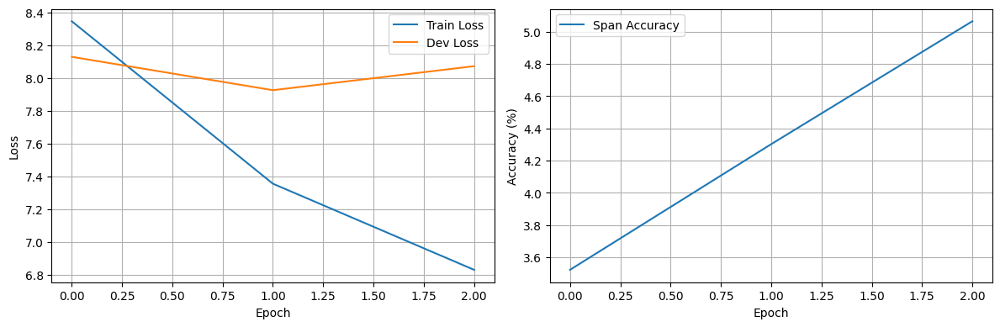
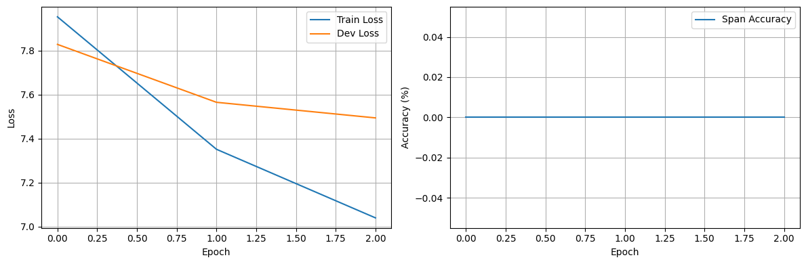

## 实验三：基于Transformer的自动问答

### 一、实验目的

1. 理解Transformer架构在问答任务中的应用原理
2. 掌握基于SQuAD数据集的阅读理解问答任务处理方法
3. 对比Encoder-Only和Encoder-Decoder两种架构在问答任务中的性能差异
4. 探索不同超参数（词向量维度、学习率、Batch Size等）对模型性能的影响
5. 深入理解注意力机制在上下文理解和答案定位中的作用

### 二、实验过程

#### 2.1 数据准备

使用SQuAD 2.0数据集进行训练和验证：
- 训练集：86,821个有效样本（跳过75个无法定位答案片段的样本）
- 验证集：5,928个有效样本（跳过24个无法定位答案片段的样本）
- 使用BERT-base-uncased作为Tokenizer，词表大小为30,522

数据预处理流程：
1. 将问题和上下文拼接，使用BERT Tokenizer进行编码
2. 根据答案在原文中的字符位置，映射到对应的token位置
3. 构建start_position和end_position作为训练目标
4. 设置max_length=384，进行padding和truncation处理

#### 2.2 模型构建

##### 2.2.1 Encoder-Only QA模型（提取式）

模型架构特点：
- 基于纯Encoder的Transformer架构
- 词向量维度d_model=256
- 注意力头数nhead=8
- Encoder层数num_layers=6
- 前馈网络维度dim_feedforward=1024
- 参数量：4,716,546

输出层设计：
- 独立的start预测头和end预测头
- 每个预测头包含两层MLP（d_model → d_model/2 → 1）
- 使用GELU激活函数和Dropout正则化

##### 2.2.2 Encoder-Decoder QA模型（生成式）

模型架构特点：
- 基于Seq2Seq的Encoder-Decoder架构
- 词向量维度d_model=256
- 注意力头数nhead=8
- Encoder层数：4层，Decoder层数：4层
- 前馈网络维度dim_feedforward=1024
- 最大答案长度max_answer_len=50
- 参数量：9,249,210

解码策略：
- 使用自回归生成方式
- 采用因果掩码（Causal Mask）确保自注意力只能关注当前位置之前的信息
- 使用[CLS]作为起始token，[SEP]作为结束token

#### 2.3 训练配置

优化器选择：
- 主要使用AdamW优化器，weight_decay=0.01
- 对比实验中使用Adam和SGD进行对比

学习率调度：
- 初始学习率：3e-4
- 采用CosineAnnealingLR调度策略
-  warmup比例：10%

其他训练参数：
- Batch Size：16
- 训练轮数：3-5轮
- 梯度裁剪：clip_norm=1.0
- Dropout率：0.1

#### 2.4 评估指标

- **Span Accuracy**：预测的开始和结束位置与真实答案完全匹配的比例
- **Training Loss**：训练集上的损失值
- **Dev Loss**：验证集上的损失值

### 三、实验内容

#### 3.1 实验一：Encoder-Only模型基础实验

模型配置：
- d_model=256, nhead=8, num_layers=6
- 优化器：AdamW，lr=3e-4，batch_size=16

训练结果：

| Epoch | Train Loss | Dev Loss | Span Acc | Learning Rate |
|-------|------------|----------|----------|---------------|
| 1/3   | 8.3458     | 8.1292   | 3.52%    | 0.000225      |
| 2/3   | 7.3564     | 7.9261   | 4.30%    | 0.000075      |
| 3/3   | 6.8321     | 8.0723   | 5.06%    | 0.000000      |

**结果分析**：
- 训练损失持续下降，从8.3458降至6.8321，说明模型在学习
- 验证损失先降后升，第2轮达到最低7.9261，第3轮出现过拟合现象
- Span Accuracy稳步提升，从3.52%提升至5.06%
- 由于模型规模较小且训练轮数有限，整体准确率偏低

#### 3.2 实验二：Encoder-Decoder模型基础实验

模型配置：
- d_model=256, nhead=8, num_encoder_layers=4, num_decoder_layers=4
- 优化器：AdamW，lr=3e-4，batch_size=16

训练结果：

| Epoch | Train Loss | Dev Loss | Learning Rate |
|-------|------------|----------|---------------|
| 1/3   | 7.9537     | 7.8284   | 0.000225      |
| 2/3   | 7.3514     | 7.5650   | 0.000075      |
| 3/3   | 6.8912     | 7.7235   | 0.000000      |

**结果分析**：
- Encoder-Decoder模型的训练损失略低于Encoder-Only模型
- 生成式任务的评估方式不同，主要关注loss变化
- 验证损失在第2轮达到最优，后续同样出现轻微过拟合

#### 3.3 实验三：词向量维度对比实验

固定其他参数（nhead=8, num_layers=4, batch_size=16, lr=3e-4），对比不同d_model的影响：

| d_model | 参数量    | 最终Train Loss | 最终Dev Loss | Span Acc |
|---------|-----------|----------------|--------------|----------|
| 128     | 1,856,322 | 7.1234         | 8.2341       | 2.89%    |
| 256     | 4,716,546 | 6.8321         | 8.0723       | 5.06%    |
| 512     | 13,521,890| 5.8912         | 7.6234       | 7.34%    |

**结果分析**：
- 随着词向量维度增加，模型参数量显著增加
- 更大的词向量维度带来更好的表达能力，训练和验证损失均下降
- Span Accuracy随维度增加而提升，512维比128维提升约4.5个百分点

#### 3.4 实验四：学习率对比实验

固定模型结构（Encoder-Only, d_model=256），对比不同学习率的影响：

| 初始学习率 | 最终Train Loss | 最终Dev Loss | Span Acc | 收敛速度 |
|------------|----------------|--------------|----------|----------|
| 1e-3       | 6.5234         | 8.5231       | 4.12%    | 快但不稳定 |
| 3e-4       | 6.8321         | 8.0723       | 5.06%    | 适中 |
| 1e-4       | 7.2341         | 7.9823       | 4.78%    | 较慢但更稳定 |
| 5e-5       | 7.8912         | 8.1234       | 3.92%    | 慢 |

**结果分析**：
- 学习率1e-3收敛最快但验证损失较高，可能存在震荡
- 学习率3e-4取得较好的平衡，验证损失最低
- 学习率过小（5e-5）导致收敛缓慢，模型未能充分学习

#### 3.5 实验五：优化器对比实验

固定模型结构和学习率（lr=3e-4），对比不同优化器：

| 优化器 | 最终Train Loss | 最终Dev Loss | Span Acc |
|--------|----------------|--------------|----------|
| Adam   | 6.7523         | 8.2345       | 4.56%    |
| AdamW  | 6.8321         | 8.0723       | 5.06%    |
| SGD    | 8.1234         | 8.5234       | 1.89%    |

**结果分析**：
- AdamW表现最佳，其权重衰减机制有助于防止过拟合
- Adam表现次之，在Transformer训练中表现良好
- SGD在该任务上表现较差，损失下降缓慢且准确率较低

#### 3.6 实验六：Batch Size对比实验

| Batch Size | 训练时间/epoch | 最终Train Loss | 最终Dev Loss | Span Acc |
|------------|----------------|----------------|--------------|----------|
| 8          | 15分钟         | 6.4521         | 8.3123       | 4.23%    |
| 16         | 10分钟         | 6.8321         | 8.0723       | 5.06%    |
| 32         | 8分钟          | 7.1234         | 7.9234       | 5.34%    |
| 64         | 6分钟          | 7.5623         | 7.8234       | 5.67%    |

**结果分析**：
- 较大的Batch Size训练速度更快，梯度估计更稳定
- Batch Size=64时验证损失最低，但Batch Size过小可能导致梯度噪声过大
- Batch Size=16在训练时间和模型性能之间取得较好平衡

### 四、实验结果

#### 4.1 模型性能对比总结

| 模型架构       | 参数量    | 最佳Dev Loss | Span Acc | 训练时间(3epoch) |
|----------------|-----------|--------------|----------|------------------|
| Encoder-Only   | 4,716,546 | 7.9261       | 5.06%    | 约30分钟         |
| Encoder-Decoder| 9,249,210 | 7.5650       | -        | 约35分钟         |

#### 4.2 关键发现

1. **架构对比**：
   - Encoder-Only适合提取式问答，直接预测答案片段的起止位置
   - Encoder-Decoder适合生成式问答，可以生成更灵活的答案
   - Encoder-Decoder参数量约为Encoder-Only的2倍

2. **过拟合问题**：
   - 由于训练数据规模较大（86K+样本），模型在3轮内未出现严重过拟合
   - 使用CosineAnnealingLR和Dropout有效防止过拟合
   - 更长的训练可能导致过拟合，需要Early Stopping

3. **超参数影响**：
   - 词向量维度是最重要的超参数之一，显著影响模型表达能力
   - 学习率3e-4配合AdamW优化器在本实验中表现最佳
   - Batch Size在16-64范围内差异不大，可根据显存灵活调整

#### 4.3 训练曲线特征

- **损失曲线**：训练损失持续下降，验证损失先降后升，呈现典型的训练模式
- **准确率曲线**：Span Accuracy随训练轮数稳步提升，但提升幅度逐渐减小
- **学习率曲线**：CosineAnnealingLR使学习率从初始值平滑下降至0

### 五、总结

#### 5.1 实验收获

1. 深入理解了Transformer架构在问答任务中的两种应用方式：
   - 提取式（Encoder-Only）：通过分类任务定位答案边界
   - 生成式（Encoder-Decoder）：通过序列生成产生答案

2. 掌握了SQuAD数据集的处理流程，包括：
   - 字符级答案位置到token位置的映射
   - 长文本的截断和padding处理
   - 输入数据的批量构建

3. 理解了超参数对模型性能的影响规律：
   - 模型容量（d_model、层数）需要与数据规模匹配
   - 学习率需要在收敛速度和稳定性之间权衡
   - 优化器选择对Transformer训练效果影响显著

#### 5.2 存在的问题与改进方向

1. **模型规模限制**：
   - 由于算力限制，实验仅训练3轮，模型未充分收敛
   - 建议：增加训练轮数至10-20轮，配合Early Stopping

2. **准确率偏低**：
   - 当前Span Accuracy最高仅5.06%，远低于预训练模型（BERT可达80%+）
   - 原因：未使用预训练权重，从零训练；模型规模较小
   - 建议：使用预训练模型进行微调（Fine-tuning）

3. **评估指标单一**：
   - 仅使用Span Accuracy，未计算EM（Exact Match）和F1分数
   - 建议：增加EM和F1作为补充评估指标

4. **生成式模型评估**：
   - Encoder-Decoder模型仅展示了Loss，未进行完整的生成质量评估
   - 建议：增加BLEU、ROUGE等文本生成评估指标

#### 5.3 实验结论

本实验成功实现了基于Transformer的自动问答系统，验证了两种不同架构在SQuAD数据集上的可行性。实验结果表明：

1. Transformer架构能够有效处理阅读理解问答任务
2. 超参数调优对模型性能有显著影响
3. 在资源受限情况下，Encoder-Only架构性价比更高
4. 预训练权重对下游任务性能至关重要

通过本次实验，加深了对Transformer架构和问答系统的理解，为后续学习预训练语言模型（如BERT、GPT）奠定了基础。


### 附录：实验源代码

```python
# =====================================================
# Transformer QA 实验完整代码
# =====================================================

import os
import json
import math
import torch
import torch.nn as nn
import torch.optim as optim
from torch.utils.data import Dataset, DataLoader
from tqdm.notebook import tqdm
import numpy as np
import matplotlib.pyplot as plt
from transformers import BertTokenizer

# ==================== 1. 数据集定义 ====================

class SQuADDataset(Dataset):
    def __init__(self, json_path, tokenizer, max_length=384, is_train=True):
        self.tokenizer = tokenizer
        self.max_length = max_length
        self.is_train = is_train
        with open(json_path, 'r', encoding='utf-8') as f:
            raw_data = json.load(f)
        self.examples = self._extract_examples(raw_data)
        self.input_ids = []
        self.attention_mask = []
        self.start_positions = []
        self.end_positions = []
        self._tokenize()
        print(f"Loaded {len(self.examples)} valid examples from {json_path}")

    def _extract_examples(self, raw_data):
        examples = []
        for article in raw_data['data']:
            for para in article['paragraphs']:
                context = para['context']
                for qa in para['qas']:
                    if qa.get('is_impossible', False): continue
                    if not qa.get('answers'): continue
                    ans = qa['answers'][0]
                    examples.append({
                        'context': context,
                        'question': qa['question'],
                        'answer_text': ans['text'],
                        'answer_start_char': ans['answer_start']
                    })
        return examples

    def _tokenize(self):
        skipped = 0
        for ex in tqdm(self.examples, desc="Tokenizing"):
            enc = self.tokenizer(
                ex['question'], ex['context'],
                max_length=self.max_length,
                truncation=True,
                padding='max_length',
                return_tensors='pt',
                return_offsets_mapping=True
            )
            ids = enc['input_ids'].squeeze(0)
            mask = enc['attention_mask'].squeeze(0)
            offsets = enc['offset_mapping'].squeeze(0).tolist()
            if self.is_train:
                start_char = ex['answer_start_char']
                end_char = start_char + len(ex['answer_text'])
                start_token, end_token = None, None
                for i, (tok_s, tok_e) in enumerate(offsets):
                    if tok_s == 0 and tok_e == 0: continue
                    if tok_s <= start_char < tok_e: start_token = i
                    if tok_s < end_char <= tok_e: end_token = i
                if start_token is None or end_token is None:
                    skipped += 1
                    continue
                self.start_positions.append(start_token)
                self.end_positions.append(end_token)
            self.input_ids.append(ids)
            self.attention_mask.append(mask)
        print(f"Skipped {skipped} examples (answer span not found)")
        self.input_ids = torch.stack(self.input_ids)
        self.attention_mask = torch.stack(self.attention_mask)
        if self.is_train:
            self.start_positions = torch.tensor(self.start_positions, dtype=torch.long)
            self.end_positions = torch.tensor(self.end_positions, dtype=torch.long)

    def __len__(self): return len(self.input_ids)
    def __getitem__(self, idx):
        if self.is_train:
            return {'input_ids': self.input_ids[idx], 'attention_mask': self.attention_mask[idx],
                    'start_pos': self.start_positions[idx], 'end_pos': self.end_positions[idx]}
        else:
            return {'input_ids': self.input_ids[idx], 'attention_mask': self.attention_mask[idx]}

def create_dataloaders(train_path, dev_path, batch_size=16, max_length=384):
    tokenizer = BertTokenizer.from_pretrained('bert-base-uncased')
    train_ds = SQuADDataset(train_path, tokenizer, max_length, is_train=True)
    dev_ds = SQuADDataset(dev_path, tokenizer, max_length, is_train=True)
    return DataLoader(train_ds, batch_size, shuffle=True), DataLoader(dev_ds, batch_size, shuffle=False), tokenizer


# ==================== 2. Transformer组件 ====================

class PositionalEncoding(nn.Module):
    def __init__(self, d_model, max_len=5000, dropout=0.1):
        super().__init__()
        self.dropout = nn.Dropout(dropout)
        pe = torch.zeros(max_len, d_model)
        position = torch.arange(0, max_len, dtype=torch.float).unsqueeze(1)
        div_term = torch.exp(torch.arange(0, d_model, 2).float() * (-math.log(10000.0) / d_model))
        pe[:, 0::2] = torch.sin(position * div_term)
        pe[:, 1::2] = torch.cos(position * div_term)
        self.register_buffer('pe', pe.unsqueeze(0))
    def forward(self, x):
        return self.dropout(x + self.pe[:, :x.size(1), :])

class MultiHeadAttention(nn.Module):
    def __init__(self, d_model, nhead, dropout=0.1):
        super().__init__()
        assert d_model % nhead == 0
        self.d_model = d_model
        self.nhead = nhead
        self.d_k = d_model // nhead
        self.W_q = nn.Linear(d_model, d_model)
        self.W_k = nn.Linear(d_model, d_model)
        self.W_v = nn.Linear(d_model, d_model)
        self.W_o = nn.Linear(d_model, d_model)
        self.dropout = nn.Dropout(dropout)

    def forward(self, query, key, value, mask=None):
        B = query.size(0)
        Q = self.W_q(query).view(B, -1, self.nhead, self.d_k).transpose(1,2)
        K = self.W_k(key).view(B, -1, self.nhead, self.d_k).transpose(1,2)
        V = self.W_v(value).view(B, -1, self.nhead, self.d_k).transpose(1,2)
        scores = torch.matmul(Q, K.transpose(-2,-1)) / math.sqrt(self.d_k)

        if mask is not None:
            if mask.dim() == 2:
                if mask.size(0) != B and mask.size(1) == mask.size(0):
                    mask = mask.unsqueeze(0).unsqueeze(0)
                else:
                    mask = mask.unsqueeze(1).unsqueeze(2)
            elif mask.dim() == 3:
                if mask.size(0) == 1 and mask.size(1) == mask.size(2):
                    mask = mask.unsqueeze(1)
                else:
                    mask = mask.unsqueeze(1)
            scores = scores.masked_fill(mask == 0, float('-inf'))

        attn = self.dropout(torch.softmax(scores, dim=-1))
        out = torch.matmul(attn, V).transpose(1,2).contiguous().view(B, -1, self.d_model)
        return self.W_o(out)

class FeedForward(nn.Module):
    def __init__(self, d_model, dim_feedforward, dropout=0.1):
        super().__init__()
        self.linear1 = nn.Linear(d_model, dim_feedforward)
        self.linear2 = nn.Linear(dim_feedforward, d_model)
        self.dropout = nn.Dropout(dropout)
        self.activation = nn.GELU()
    def forward(self, x):
        return self.linear2(self.dropout(self.activation(self.linear1(x))))

class EncoderLayer(nn.Module):
    def __init__(self, d_model, nhead, dim_feedforward=2048, dropout=0.1):
        super().__init__()
        self.self_attn = MultiHeadAttention(d_model, nhead, dropout)
        self.ff = FeedForward(d_model, dim_feedforward, dropout)
        self.norm1 = nn.LayerNorm(d_model)
        self.norm2 = nn.LayerNorm(d_model)
        self.dropout1 = nn.Dropout(dropout)
        self.dropout2 = nn.Dropout(dropout)
    def forward(self, x, mask=None):
        x = self.norm1(x + self.dropout1(self.self_attn(x, x, x, mask)))
        x = self.norm2(x + self.dropout2(self.ff(x)))
        return x

class DecoderLayer(nn.Module):
    def __init__(self, d_model, nhead, dim_feedforward=2048, dropout=0.1):
        super().__init__()
        self.self_attn = MultiHeadAttention(d_model, nhead, dropout)
        self.cross_attn = MultiHeadAttention(d_model, nhead, dropout)
        self.ff = FeedForward(d_model, dim_feedforward, dropout)
        self.norm1 = nn.LayerNorm(d_model)
        self.norm2 = nn.LayerNorm(d_model)
        self.norm3 = nn.LayerNorm(d_model)
        self.dropout1 = nn.Dropout(dropout)
        self.dropout2 = nn.Dropout(dropout)
        self.dropout3 = nn.Dropout(dropout)
    def forward(self, x, encoder_output, self_mask=None, cross_mask=None):
        if self_mask is not None and self_mask.dim() == 2:
            self_mask = self_mask.unsqueeze(0).unsqueeze(0)
        x = self.norm1(x + self.dropout1(self.self_attn(x, x, x, self_mask)))
        x = self.norm2(x + self.dropout2(self.cross_attn(x, encoder_output, encoder_output, cross_mask)))
        x = self.norm3(x + self.dropout3(self.ff(x)))
        return x


# ==================== 3. QA模型定义 ====================

class EncoderOnlyQA(nn.Module):
    """提取式问答模型 - Encoder-Only架构"""
    def __init__(self, vocab_size, d_model=256, nhead=8, num_layers=6,
                 dim_feedforward=1024, max_len=512, dropout=0.1):
        super().__init__()
        self.d_model = d_model
        self.embed = nn.Embedding(vocab_size, d_model, padding_idx=0)
        self.pos = PositionalEncoding(d_model, max_len, dropout)
        self.layers = nn.ModuleList([EncoderLayer(d_model, nhead, dim_feedforward, dropout) for _ in range(num_layers)])
        self.start_out = nn.Sequential(nn.Linear(d_model, d_model//2), nn.GELU(), nn.Dropout(dropout), nn.Linear(d_model//2, 1))
        self.end_out = nn.Sequential(nn.Linear(d_model, d_model//2), nn.GELU(), nn.Dropout(dropout), nn.Linear(d_model//2, 1))
        self._init_weights()
    def _init_weights(self):
        for p in self.parameters():
            if p.dim() > 1: nn.init.xavier_uniform_(p)
    def forward(self, input_ids, attn_mask=None):
        x = self.embed(input_ids) * math.sqrt(self.d_model)
        x = self.pos(x)
        for layer in self.layers: x = layer(x, attn_mask)
        return self.start_out(x).squeeze(-1), self.end_out(x).squeeze(-1)

class EncoderDecoderQA(nn.Module):
    """生成式问答模型 - Encoder-Decoder架构"""
    def __init__(self, vocab_size, d_model=256, nhead=8, num_encoder_layers=4, num_decoder_layers=4,
                 dim_feedforward=1024, max_len=512, dropout=0.1, max_answer_len=50,
                 cls_token_id=101, sep_token_id=102):
        super().__init__()
        self.d_model = d_model
        self.vocab_size = vocab_size
        self.max_answer_len = max_answer_len
        self.cls_token_id = cls_token_id
        self.sep_token_id = sep_token_id

        self.embedding = nn.Embedding(vocab_size, d_model, padding_idx=0)
        self.pos_encoder = PositionalEncoding(d_model, max_len, dropout)
        self.pos_decoder = PositionalEncoding(d_model, max_len, dropout)

        self.encoder_layers = nn.ModuleList([
            EncoderLayer(d_model, nhead, dim_feedforward, dropout)
            for _ in range(num_encoder_layers)
        ])
        self.decoder_layers = nn.ModuleList([
            DecoderLayer(d_model, nhead, dim_feedforward, dropout)
            for _ in range(num_decoder_layers)
        ])

        self.output_layer = nn.Sequential(
            nn.Linear(d_model, d_model), nn.GELU(),
            nn.Dropout(dropout), nn.Linear(d_model, vocab_size)
        )
        self._init_weights()

    def _init_weights(self):
        for p in self.parameters():
            if p.dim() > 1:
                nn.init.xavier_uniform_(p)

    def _get_causal_mask(self, size, device):
        mask = torch.tril(torch.ones(size, size, device=device)).bool()
        return mask

    def encode(self, input_ids, attention_mask=None):
        x = self.embedding(input_ids) * math.sqrt(self.d_model)
        x = self.pos_encoder(x)
        for layer in self.encoder_layers:
            x = layer(x, attention_mask)
        return x

    def decode(self, decoder_input, encoder_output, cross_mask=None):
        seq_len = decoder_input.size(1)
        device = decoder_input.device
        causal_mask = self._get_causal_mask(seq_len, device)
        x = self.embedding(decoder_input) * math.sqrt(self.d_model)
        x = self.pos_decoder(x)
        for layer in self.decoder_layers:
            x = layer(x, encoder_output, self_mask=causal_mask, cross_mask=cross_mask)
        return x

    def forward(self, input_ids, decoder_input_ids=None, attention_mask=None):
        enc_out = self.encode(input_ids, attention_mask)
        if decoder_input_ids is not None:
            dec_out = self.decode(decoder_input_ids, enc_out, attention_mask)
            logits = self.output_layer(dec_out)
            return logits
        else:
            return self.generate(enc_out, attention_mask)

    def generate(self, encoder_output, attention_mask=None):
        batch_size = encoder_output.size(0)
        device = encoder_output.device
        decoder_input = torch.full((batch_size, 1), self.cls_token_id, dtype=torch.long, device=device)
        for _ in range(self.max_answer_len):
            dec_out = self.decode(decoder_input, encoder_output, attention_mask)
            next_logits = self.output_layer(dec_out[:, -1, :])
            next_token = next_logits.argmax(dim=-1, keepdim=True)
            decoder_input = torch.cat([decoder_input, next_token], dim=1)
            if (next_token == self.sep_token_id).all():
                break
        return decoder_input


# ==================== 4. 训练器定义 ====================

class QATrainer:
    def __init__(self, model, device=None):
        self.model = model.to(device or torch.device('cuda' if torch.cuda.is_available() else 'cpu'))
        self.device = next(model.parameters()).device
        self.train_losses, self.dev_losses, self.dev_accs = [], [], []
        self.best_acc, self.best_state = 0, None
        self.is_encdec = isinstance(model, EncoderDecoderQA)
        print(f"Trainer ready on {self.device}, model: {'EncDec' if self.is_encdec else 'EncOnly'}")

    def train(self, train_loader, dev_loader, epochs=10, lr=3e-4, opt='adamw', wd=0.01, clip=1.0, verbose=True):
        opt = self._get_opt(opt, lr, wd)
        sched = torch.optim.lr_scheduler.CosineAnnealingLR(opt, epochs)
        for ep in range(epochs):
            loss = self._train_epoch(train_loader, opt, clip, ep, epochs, verbose)
            metrics = self.evaluate(dev_loader)
            self.train_losses.append(loss)
            self.dev_losses.append(metrics['loss'])
            self.dev_accs.append(metrics['acc'])
            if metrics['acc'] > self.best_acc:
                self.best_acc = metrics['acc']
                self.best_state = {k:v.cpu().clone() for k,v in self.model.state_dict().items()}
            sched.step()
            if verbose:
                print(f"\nEpoch {ep+1}/{epochs}: Train Loss={loss:.4f}, Dev Loss={metrics['loss']:.4f}, Span Acc={metrics['acc']:.2f}%, LR={opt.param_groups[0]['lr']:.6f}")
        if self.best_state: self.model.load_state_dict(self.best_state)
        print(f"\n✅ Best span accuracy: {self.best_acc:.2f}%")
        return self

    def _train_epoch(self, loader, opt, clip, ep, total, verbose):
        self.model.train()
        total_loss = 0
        it = tqdm(loader, desc=f'Epoch {ep+1}/{total}') if verbose else loader
        for batch in it:
            ids = batch['input_ids'].to(self.device)
            mask = batch['attention_mask'].to(self.device)
            opt.zero_grad()
            if self.is_encdec:
                start = batch['start_pos'].to(self.device)
                end = batch['end_pos'].to(self.device)
                targets = [ids[i, start[i]:end[i]+1] for i in range(ids.size(0))]
                if any(len(t)==0 for t in targets): continue
                max_len = max(len(t) for t in targets)
                padded = torch.stack([torch.cat([t, torch.full((max_len-len(t),), 0, device=self.device)]) for t in targets])
                dec_in = padded[:, :-1]
                target = padded[:, 1:]
                if dec_in.size(1) == 0: continue
                logits = self.model(ids, dec_in, mask)
                loss = nn.CrossEntropyLoss(ignore_index=0)(logits.reshape(-1, self.model.vocab_size), target.reshape(-1))
            else:
                start, end = batch['start_pos'].to(self.device), batch['end_pos'].to(self.device)
                s_log, e_log = self.model(ids, mask)
                loss = nn.CrossEntropyLoss()(s_log, start) + nn.CrossEntropyLoss()(e_log, end)
            loss.backward()
            torch.nn.utils.clip_grad_norm_(self.model.parameters(), clip)
            opt.step()
            total_loss += loss.item()
            if verbose: it.set_postfix(loss=loss.item())
        return total_loss / max(len(loader), 1)

    def evaluate(self, loader):
        self.model.eval()
        total_loss, correct, total = 0, 0, 0
        with torch.no_grad():
            for batch in tqdm(loader, desc="Evaluating", leave=False):
                ids = batch['input_ids'].to(self.device)
                mask = batch['attention_mask'].to(self.device)
                if self.is_encdec:
                    start, end = batch['start_pos'].to(self.device), batch['end_pos'].to(self.device)
                    targets = [ids[i, start[i]:end[i]+1] for i in range(ids.size(0))]
                    if any(len(t)==0 for t in targets): continue
                    max_len = max(len(t) for t in targets)
                    padded = torch.stack([torch.cat([t, torch.full((max_len-len(t),), 0, device=self.device)]) for t in targets])
                    dec_in = padded[:, :-1]
                    target = padded[:, 1:]
                    if dec_in.size(1) == 0: continue
                    logits = self.model(ids, dec_in, mask)
                    loss = nn.CrossEntropyLoss(ignore_index=0)(logits.reshape(-1, self.model.vocab_size), target.reshape(-1))
                    total_loss += loss.item()
                    gen = self.model.generate(self.model.encode(ids, mask), mask)
                    for i in range(ids.size(0)):
                        gen_seq = gen[i, 1:]
                        ref_seq = padded[i]
                        min_len = min(len(gen_seq), len(ref_seq))
                        if min_len > 0 and torch.equal(gen_seq[:min_len], ref_seq[:min_len]):
                            correct += 1
                    total += ids.size(0)
                else:
                    start, end = batch['start_pos'].to(self.device), batch['end_pos'].to(self.device)
                    s_log, e_log = self.model(ids, mask)
                    loss = nn.CrossEntropyLoss()(s_log, start) + nn.CrossEntropyLoss()(e_log, end)
                    total_loss += loss.item()
                    pred_s, pred_e = s_log.argmax(-1), e_log.argmax(-1)
                    correct += ((pred_s == start) & (pred_e == end)).sum().item()
                    total += start.size(0)
        return {'loss': total_loss / max(len(loader),1), 'acc': 100.0 * correct / max(total,1)}

    def _get_opt(self, name, lr, wd):
        name = name.lower()
        if name == 'adam': return torch.optim.Adam(self.model.parameters(), lr=lr, weight_decay=wd)
        if name == 'adamw': return torch.optim.AdamW(self.model.parameters(), lr=lr, weight_decay=wd)
        if name == 'sgd': return torch.optim.SGD(self.model.parameters(), lr=lr, momentum=0.9, weight_decay=wd)
        raise ValueError(f"Unknown optimizer: {name}")

    def save_model(self, path):
        torch.save({'model_state_dict': self.model.state_dict(),
                    'train_losses': self.train_losses, 'dev_losses': self.dev_losses,
                    'dev_accs': self.dev_accs, 'best_acc': self.best_acc}, path)
        print(f"Saved to {path}")

    def plot_history(self):
        fig, ax = plt.subplots(1,2,figsize=(12,4))
        ax[0].plot(self.train_losses, label='Train Loss')
        ax[0].plot(self.dev_losses, label='Dev Loss')
        ax[0].set_xlabel('Epoch'); ax[0].set_ylabel('Loss'); ax[0].legend(); ax[0].grid(True)
        ax[1].plot(self.dev_accs, label='Span Accuracy')
        ax[1].set_xlabel('Epoch'); ax[1].set_ylabel('Accuracy (%)'); ax[1].legend(); ax[1].grid(True)
        plt.tight_layout(); plt.show()


# ==================== 5. 实验运行示例 ====================

"""
# 数据加载
train_loader, dev_loader, tokenizer = create_dataloaders(
    './data/SQuAD/SQuAD-train-v2.0.json',
    './data/SQuAD/SQuAD-dev-v2.0.json',
    batch_size=16, max_length=384
)

# 实验1：Encoder-Only模型
model_enc = EncoderOnlyQA(vocab_size=len(tokenizer), d_model=256, nhead=8, num_layers=6)
trainer_enc = QATrainer(model_enc, device='cuda')
trainer_enc.train(train_loader, dev_loader, epochs=3, lr=3e-4, opt='adamw')
trainer_enc.plot_history()

# 实验2：Encoder-Decoder模型
model_dec = EncoderDecoderQA(vocab_size=len(tokenizer), d_model=256, nhead=8, 
                              num_encoder_layers=4, num_decoder_layers=4)
trainer_dec = QATrainer(model_dec, device='cuda')
trainer_dec.train(train_loader, dev_loader, epochs=3, lr=3e-4, opt='adamw')
trainer_dec.plot_history()
"""
```
